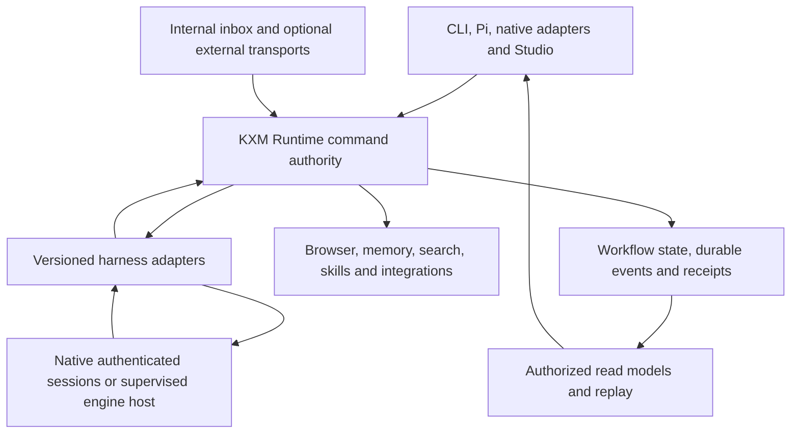

# One KXM installation, shared capabilities across harnesses

## Outcome and authority

Install `@kontextmind/kxm` once for shared workflows, browser operations, memory,
search, skills, Studio and integrations. Native harnesses keep their sessions
and authentication; KXM supplies the workflow experience and shared services.
The portability target is equivalent operations and evidence across CLI, MCP,
Pi and native adapters, with explicit differences in available controls.

This is the consolidated **proposed scope and dependency plan** for all 36 fork
reviews. M0–M9 retain their IDs. There is one definition of each packet below;
research reports supply supporting mechanisms, source evidence and experiments.
[`implementation-plan.md`](implementation-plan.md) remains the sole execution
tracker and authority for accepted decisions, owners, start triggers and phase
gates. Its blockers override any proposed sequence here. No packet is completed,
worker admitted or release approved by this documentation review.

Current code was checked at **02aaed31**, which contains the previously accepted
Phase 11 A1 slice; [Tracking](implementation-plan.md) records its exact acceptance
commits and forward-port evidence. The original 29
fork reviews and CLI observations retain their **5ff9f642** context; the last
seven compare against 02aaed31. The [36-fork register](evidence/unified-kxm-forks.json)
preserves their exact revisions. Research is dated evidence, not a claim that
every upstream version or installed capability has been re-tested.

## Architecture and ownership

Build the KXM workflow harness on the existing Runtime. Keep TS for application
and adapter code; compare engines and specialist components where evidence can
justify a change. A new model/tool loop or a merger of Pi, OpenCode and DSH is
not selected. Pi remains the only admitted long-lived worker; a native CLI
helper or one-shot route is a different capability.

- **One writer at each boundary:** Runtime validates commands and observations,
  owns task admission and settlement, and uses existing stores/scheduling. An
  adapter or UI cannot write around it. An embedded engine may own a separate
  session store, but cannot independently accept KXM workflow results or restart
  effectful work before KXM reconciles the attempt.
- **Stable identity:** project → coordinator/channel/conversation → run/attempt
  → host/workspace/native session/turn are distinct bindings. A coordinator is a
  persistent role and authority ceiling, not an always-running model. Model
  replacement does not lose its inbox or authorize a different billing route.
- **Separate facts:** message received, command persisted, native input accepted,
  work running, producer final, verification, workflow acceptance and external
  delivery have different receipts. Do not infer success from prose or an idle
  screen. Unprovable effects remain uncertain until reconciled.
- **One package, selective activation:** extend existing exports, generators and
  manifests. Thin adapters expose the same contracts. Optional engines, browser
  assets and parsers use explicit versioned KXM setup; imports and npm lifecycle
  hooks do not silently install extensions, configure every host or provision
  accounts. Split internal modules when useful; extract a package only for a real
  consumer, build or version boundary.
- **One permission floor:** project/actor/task/effect policy survives every
  adapter. Tool filtering and shell guards narrow access but do not prove native
  or OS isolation. External messages and retrieved content cannot grant authority.

## Delivery order

Dependencies name the **contracts a slice uses**, not completion of every feature
in an earlier packet. Earlier canonical phase gates still apply. Browser repair,
full modes, email/SMS and document parsing must not become accidental prerequisites
for basic progress. No dates or effort estimates are promised before the first
slice establishes them.

| Packet | Result | Required contracts for its first slice | Existing phases |
|---|---|---|---|
| M0 | Truthful results, redaction and repaired service boundaries | Current source reproductions | 2–4, 9–11 repairs |
| M1 | One install, readiness and stable capability/agent identity | Applicable M0 boundary; current package surface | 1, 4, 5 |
| M2 | Durable intake and useful live task progress | M0 result/redaction, M1 identity; M6 minimal wake policy for inbox dispatch | 6, 10, 11 |
| M3 | Exact resume, queued input, steering and channel controls | M1 bindings and M2 receipts; newly engine-dependent controls also need the engine decision | 7, 11 |
| M4 | One browser service | M0 browser lease/compatibility and M1 backend readiness | 4, 10, 11 admission |
| M5 | Scoped recall, retrieval and recoverable learning candidates | M0 redaction, M1 scope and optional-component identity | 9 |
| M6 | Portable skills, approved workflows and wake policy | Existing Runtime policy; M1 identity, M2 events only where used | 3, 4, 7, 9, 11 restrictions |
| M7 | Studio over shared task, inbox and artifact APIs; **hosted operator surface is the tenant portal reading/driving the loopback hub, which is the MVP path** | M0 UI boundary; polling run/receipt state first, snapshot/replay only when an observed gap needs it; other services only for their panels | 10 |
| M8 | Native/provider setup and optional external integrations | M1 readiness, M0 secret handling, M6 authorization where effects require it | 4, 9, 11 admission |
| M9 | Evidence for the declared release capabilities/platforms, **including the selected Linux hosted tenant deployment and one restore witness** | Selected scope's contracts and all applicable canonical blockers/gates | 5 and every affected gate |

### First product slice — **superseded; the queue in Tracking is the only sequence**

The numbered sequence below was written before the hosted MVP was selected and is kept as
proposed-scope reasoning, not as a plan of record: **do not schedule from it**. S0–S5 in
[`implementation-plan.md`](implementation-plan.md) (Still open → The one queue) decides
order, and coordinator-inbox and replay work sit behind their post-MVP triggers there.

1. Repair typed Pi outcomes, secret persistence and Studio's missing-handler
   result; represent unintegrated controls as unavailable (M0).
2. Define one project-scoped coordinator and internal message envelope (M1), plus
   the minimal authorization, pause and wake rule in the existing Runtime (M6).
3. Persist/deduplicate one internal message and dispatch through the existing
   authorized Runtime route (M2). Begin with a deterministic producer fixture;
   use a bounded Pi RPC witness only under its applicable existing admission.
4. Show the same run in a thin read-only Studio view with snapshot/watermark,
   progress, artifact and separate verification result (M7). A reconnect or
   duplicate message cannot create another admitted task. A restart preserves
   identity and holds ambiguous attempts; exact native continuation follows M3.

**Completion evidence:** one run/attempt for duplicate ingress; same-key altered
payload rejected; correct project/cwd; useful progress before final; no persisted
secrets; invalid finals and missing handlers cannot succeed; viewer reconnect
recovers terminal facts; pause blocks both fresh dispatch and bridge resume.
Verify the actual package surface used. External accounts and full Studio editing
are outside this packet.

### Scheduling authority: none (demoted 2026-09-20)

This catalog is proposed scope and contract dependency only. **The single ordered queue is
"Still open → The one queue" in
[`implementation-plan.md`](implementation-plan.md)**, and nothing below schedules ahead of it.
Two things that used to read as next-up are explicitly not: the engine comparison and any
streaming/steering breadth. Both are post-MVP and start on an observed trigger — a reproduced
limitation of the retained route, or polling proven insufficient after the portal read/drive
slices ship. Hosting is not a parallel catalogue either: the per-tenant deployment sits in
**M7** (the portal is the operator surface; the hub binds loopback and holds no browser
identity) and **M9** (a declared Linux hosted deployment, its evidence, and the
stopped-state backup/restore witness), while coordinator-inbox and replay work stays in M2/M3
behind its consumer trigger. Rationale and boundary:
[`plan-per-tenant-hosting.md`](plan-per-tenant-hosting.md).

Before any deeper engine dependency is chosen, extend that fixture for the early Pi RPC /
supervised Pi SDK / released OpenCode 2.0.3 comparison. Test child
assignment, correction, restart ambiguity, cleanup and installation; retain the
full [engine decision matrix](research-kxm-harness-strategy.md). In parallel,
Codex and Claude are the first **new native output adapters**; their admission
does not gate the initial existing-route slice. Transport fixtures can precede
live native witnesses. Ordinary streaming does not wait for channel previews.
Use isolated workspaces and separate engine session stores. Candidate engines
perform only read-only work until KXM recovery gating is proven; the fixture host
owns any artifact/verification setup. Existing Pi RPC and native protocol probes
can proceed independently; controls that depend on a newly chosen engine wait
for its comparison decision and admission.

Then advance exact controls (M3) and independent browser/context/skill work
(M4–M6) as their contracts become ready. Expand Studio panels and editing when
the underlying services exist. M8 adds email receive/draft/scoped sending, then
operator SMS notifications and inbound routing. Masked setup input can be
brought forward wherever needed. M9 qualifies a declared release, not all future
ideas. Voice and managed mail-server deployment remain later research.

## M0 — Repair the contracts we will build on

**Scope:** small repairs at existing owners, each usable by its dependent slice.

- Enforce complete typed Pi finals and allowed outcomes; the stricter one-shot
  parser is already present. Separate producer completion from gate acceptance.
- Make absent Studio state/command handlers unavailable, never successful.
  Require scoped authentication/origin checks and safe rendering. Current
  `subagent-control.ts` maps are unintegrated sketches; do not expose their
  record-only steer/stop or premature spawn completion as working controls.
  Rechecked at 02aaed31: [Pi outcome inference](https://github.com/kontextmind/kxm/blob/02aaed31fd6160a78378c677ab27d4119f039621/plugins/kxm/src/pi-producer.ts#L85-L98)
  and [standalone subagent records](https://github.com/kontextmind/kxm/blob/02aaed31fd6160a78378c677ab27d4119f039621/plugins/kxm/src/subagent-control.ts#L120-L161).
- Redact memory body, summary, source/evidence references, tokens, URLs, native
  stderr and streamed fragments **before persistence**. Define migration or
  quarantine of existing unsafe records; a display filter cannot clean storage.
- Repair inspected self-hosted Steel JPEG decoding, `proxyUrl` mapping and
  unsupported timeout assumptions. Establish active-session ownership/lease,
  endpoint verification and uncertain-release reconciliation; hosted behavior
  needs its own witness.
- Preserve accepted A1 async probes, escalation after child close, conservative
  descendant settlement, bounded/redacted owner-only one-shot evidence v2,
  unaudited-permission refusal, one-shot price integrity and supervisor rejection
  handling. These are not new TODOs. **Status corrected 2026-09-20: three of the five
  items this line called "remaining" are accepted** — the live Claude write-refusal
  witness (2026-09-15, `task_p11-claude-write-refusal`, `e3d8a64b`), drive decoupling
  B1–B4 including HTTP drive lifetime (2026-09-16, `task_9076be56b581`), and price-catalog
  integrity beyond the one-shot path (`17efb783`). Only the Fable failure and the canonical
  acceptance contradictions remain, and both are named in
  [`implementation-plan.md`](implementation-plan.md) Still open rather than here. No Phase 11
  PASS is implied by any of this.

**Exit evidence:** defect reproductions become meaningful regressions; invalid
finals, missing handlers and unknown effects stay unsuccessful; no secret fixture
survives persisted/exported data. For slices selecting the browser/Steel boundary,
screenshot/create/release fixtures confirm binary and ownership behavior. Run the relevant slice's tests and
its required native witnesses; retain failed evidence.

## M1 — Package, capabilities and setup

**Scope:** extend existing package exports, mode schema and resource generator.

- Version capability declarations for exposure surfaces, allowed effects,
  prerequisites and separate stream/resume/steer/interrupt support. Distinguish
  detected, authenticated, protocol-verified and admitted states.
- Bind persistent coordinator/channel identity to project and authority; record
  effective activation, host and executable identity. DSH `dsh` is distinct from
  the unverified `deepseek` entry. L1 records actual runtime/CLI versions.
  M1 records identity and policy binding; M6 defines/enforces the authority ceiling,
  and M3 rebinding applies that M6 policy.
- Connect existing modes and `kxm explain` to real host tool/skill/resource
  activation. Reject unsupported selection; mandatory policy survives filtering.
- Generate registrations from canonical resources; hash complete skill bundles
  including scripts/references. Package the intended suite manifest and Studio
  assets; align release/plugin identity and helper provenance.
- Make setup repeatable, scoped and explicit about native CLIs, account auth and
  optional components. CLI/MCP-only imports must not require Pi. L6 governs any
  selected component's pinned assets, locked environment, health, repair/removal
  and offline/unsupported status. Ordinary task startup does not build binaries.

**Exit evidence:** install the actual tarball into a temporary home; test selected
exports without optional peers, real activation/reload for each selected or
advertised host surface, exact mode exposure,
repeat setup and missing-prerequisite reasons. Qualify advertised platforms via
M9, including paths with spaces. Windows CI remains paused until its canonical
resumption decision; planning platform tests does not restore it.

## M2 — Durable intake and streamed handoffs

**Scope:** incremental observations and durable internal messaging in the Runtime.

- Extend existing message cursors/idempotency and transactional run acceptance
  with coordinator identity, payload hash and durable dispatch intent. Reconcile
  existing legacy/vNext ownership; do not introduce a second authoritative inbox
  or permanent compatibility lane. Same command ID with different content fails.
- Add bounded incremental decoders to the async process owner; retain drain/reap
  and strict settlement. Current one-shot buffering/closed stdin requires real
  changes beyond a JSONL flag. Record L2 alongside the first streaming slice;
  it is not a prerequisite benchmark. A missed forwarding target opens Node
  profiling, not a language migration. L5 opens only for a reproduced OS
  containment requirement, independently of stream speed.
- Runtime maintainers own full HTTP drive lifetime decoupling under the existing
  Phase 11 item. Live paths using that drive endpoint require its lifetime
  evidence; local/deterministic protocol fixtures need not wait for that design.
- Adapt Codex JSON events and Claude print streaming, then Grok and AGY, each
  with versioned parsers. Preserve Pi RPC as reference. DSH ACP committed updates
  are not proof of token streaming. No silent auth or provider-route substitution.
- Runtime persists validated observations correlated to run/attempt/session/turn.
  Extend existing sequenced event storage and cursors; old hub SSE alone does not
  prove durable vNext streaming. Serve an authorized snapshot plus watermark and
  replay, with gap/retention handling, bounded live queues and revoked-access
  behavior. Disconnecting a viewer cannot cancel execution or reissue commands.
- Keep lifecycle, approval, effect and terminal receipts durable. Only explicitly
  disposable progress may be coalesced/dropped under pressure, with a visible gap
  notice; a slow viewer must never erase an accepted command or settlement fact.
- Store allowed complete results as hash-verified artifacts. Context-limited
  views report omissions and retrieval paths; unknown usage stays unknown.

**Exit evidence:** UTF-8/frame splits, malformed/oversized frames, stderr,
slow consumers, duplicates, stale cursors, reconnect/revocation, crash windows,
timeouts and cancellation. Useful progress must precede the final in each live
admitted path, with one terminal settlement and correct workspace. Measure time
to first useful event, silent intervals, forwarding delay, bounded memory, replay
gaps and usage freshness. A proposed 500 ms p95 local forwarding target excludes
model/network time and remains an experiment, not a measured SLA. Compare replay
of the same transcript, not two nondeterministic generations.

## M3 — Exact resume, steering and inbound channels

**Scope:** durable input journal and capability-specific controls under Runtime.

- Persist exact project/host/cwd/session/turn/attempt and ownership fence.
  Distinguish resume, fork and fresh start; reject ambiguous latest-session
  shortcuts. A stable coordinator may be rebound only through explicit policy.
- Record persisted, sent, native-accepted, consumed and settled input states only
  when the protocol proves them; queued/rejected/unsupported remain explicit.
  A pipe write proves neither consumption nor a successful redirection.
- Reconcile lost acknowledgments, restarted engine ownership and possible effects
  before retry. Gate native automatic session recovery before effectful startup.
  Pause blocks new dispatch and bridge resume; stop and steer remain separate.
- Probe Codex app-server, Pi RPC steering/follow-up, Claude duplex input and AGY
  queued turns independently. Wire actual native control behind the existing
  Runtime; retire misleading standalone control paths. Kimi Wire, Hermes ACP and
  DSH need installed identity, auth and protocol evidence first.
- Treat Claude channel eligibility as a bounded optional adapter study. Bind
  authenticated sender and exact target, deduplicate/expire/limit ingress, and
  keep incoming content separate from approval. Remote execution extends existing
  SSH helpers and Phase 6 recovery with pinned hosts, versioned helpers, explicit
  cwd, fencing, reattachment and cleanup; connection reuse is not authorization.

**Exit evidence:** exact restart/resume, wrong-project and stale-turn refusal,
duplicate input, lost acknowledgment, cancellation racing completion, and control
during a running tool. Unknown delivery/effects must be visibly held. Queued input
is useful without being mislabeled mid-turn steering. No new long-lived worker
is admitted without the existing Phase 11 evidence.

## M4 — One browser service

**Scope:** common action schema, backend negotiation and session/tab/navigation
references; compact observations, deterministic tab selection, structured capture,
native actions, artifacts and optional terminal preview. Compare betterwright
behind the same service rather than expose overlapping browser tool sets.

**Exit evidence:** equivalent browse/capture/action through selected CLI/MCP/Pi
surfaces; scripts and batches use the same policy; stale references cannot act on
another page; tasks cannot release each other's leases; uncertain external actions
receive no success receipt. Record backend/platform limits and managed runtime
readiness. Browser observations are inputs to verification, not gate acceptance.

## M5 — Memory, retrieval and context recovery

**Scope:** extend KXM memory/context owners and the current arbiter.

- Keep source evidence, candidates/reviewed knowledge and rebuildable indexes
  distinct. Filter caller/project/role access before ranking or fetching bodies.
  Return provenance, revision, detail tier, inclusion reason, omissions and health.
- Start with metadata/summary/full-source tiers and a lexical baseline. Compare
  hierarchy/embeddings on a fixed corpus; repetition never increases factual
  authority. Support reversible ID-based corrections and explicit sharing scope.
- Persist extraction input hash/version, candidate output, index work and recovery
  state. Tombstones win over delayed extraction/rebuild. Explain active forgetting,
  cache deletion and audit/Git/backup retention separately; no false erasure claim.
- M5 proposes evidence-linked memory/skill/workflow improvements and impact;
  **M6 owns reviewed activation**. Search scores cannot modify approved resources.
- Evaluate L3 Rust-backed search and L4 uv/Python document parsing against named
  workloads; neither research trial needs a Node throughput miss. Preserve bounded
  queries, stale/incomplete reporting, Unicode/path parity and fallback. uv manages
  environments; it is not itself a Python performance improvement.
- Build bounded cross-harness context packets with artifact retrieval, constraints
  and estimator identity. Optional output reduction uses documented filtering
  commands and attributed evidence; `rtk proxy` is raw pass-through. Never filter
  native protocol streams or exact verification/critic output.

**Exit evidence:** cross-project denial; ranking and correction fixtures;
crash/tombstone recovery; complete artifact retrieval after truncation; bounded
latency and relevance/extraction comparisons; unsafe source content grants no
authority. Retain unmeasured L3/L4 thresholds as experiment criteria. Qualify any
selected native/parser distribution through L6/M9 before advertising it.

## M6 — Skills, workflow governance and coordinator policy

**Scope:** one Runtime policy and workflow authority, usable without Studio.

- First supply the minimum internal wake/authorization/pause policy. Later add
  durable grouping, deadlines, quiet hours, loop suppression, sender/mention rules
  and per-conversation budgets. Timers announce durable work; Runtime schedules it.
- Preserve complete skill-bundle hashing, immutable base/head/diff review binding,
  typed outcomes, generated tool/result docs, snippets, reusable review criteria
  and workflow recipes. Companion-file changes invalidate bundle approval.
- Support revision-safe draft/validate/review/activate of workflows and learning
  candidates. Active runs keep their pinned graph; a changed proposal needs a new
  validated revision. Separate save, validation and approval in every surface.
- Add dynamic graph proposals and resource-aware concurrency only as later slices:
  roles, inputs, tool/effect bounds, joins, output contracts, workspace ownership
  and aggregate budgets covering children/retries/review. Extend existing engine
  limits; generated JavaScript is not another durable workflow scheduler.
- Translate trusted lifecycle hooks through the existing bounded process runner;
  test parsed command guards and native tool restrictions. Hooks cannot widen
  permissions. Document unsupported syntax rather than assume it safe.
- For external sends, define standing policy or approval bound to exact recipient,
  content/attachments, channel, purpose, spending and task revision. Inbox ownership
  alone grants no send permission; edits invalidate approval. A bare SMS response
  cannot establish higher authority. Reply-based approval stays deferred until it
  proves verified principal binding, exact action/revision, expiry and replay
  protection; initial SMS can link to an authenticated approval surface.

**Exit evidence:** stale review/activation conflicts; changed skill companions;
unauthorized or paused dispatch/resume; recovered wake groups without duplicate
admission; bounded fan-out/budgets; guard and hook restrictions across admitted
routes; content changes invalidate sends. Defaults, timeouts and model judgments
never become operator approval. Advanced graph work does not block basic inboxes.

## M7 — Studio, documents and human interaction

**Scope:** shared read models and commands, presented incrementally.

- First wire real project/run/coordinator/inbox state and M2 replay. Show separate
  recorded, queued, running, verified, accepted and delivery facts; unavailable
  controls remain unavailable. Resume/steer buttons depend on M3 capability proof.
- Add scoped memory impact, artifacts, workflow/capability workshop and service
  panels as M4–M6/M8 APIs exist. No web-only scheduler or separate task database.
- Support schema-driven drafts, explicit save state/history and compare-and-swap
  edits/comments against base revision. Preview/export a named revision; an editable
  live document is not an approved publication. Ambiguous anchors remain visible.
- Add source-linked diagrams with asset notices, safe Markdown/LaTeX/document
  preview, contained resources and verified artifact delivery. Reference validation
  alone does not prove semantic diagram accuracy. L4/L6 cover selected parser/export
  prerequisites such as Python, Pandoc or Chromium.
- Provide resumable questions with explicit submit target, cancellation and draft
  preservation; text and web renderers produce equivalent answer receipts.

**Exit evidence:** real command handlers, authorization/origin/revocation and safe
rendering; slow/disconnected viewer recovery; stale saves conflict; export failure
is visible; artifacts bind to the exact revision. No default or timeout submits an
answer. Read-only Studio can ship before the editor and optional service panels.

## M8 — Setup, external integrations and coordinator communications

**Scope:** optional adapters using the shared identity, policy and receipt owners.

- Preserve native Google/AGY **auth state and the `agy` helper entry**. The admitted Google
  route is the `antigravity` Pi provider (Tracking → Decided, 2026-09-15), not a CLI shell-out. Integrate useful Nous
  login/refresh and provider catalog behavior into KXM setup only for explicitly
  hosted provider routes. Do not migrate native credentials into Pi to gain features.
- Add masked local secret entry, scoped credential references and value-free
  receipts. Account-scoped quota caches record identity/pool, units, source,
  freshness, expiry, backoff and unknown/error states. Extend existing cache-token,
  price-catalog and budget contracts; reported usage, subscription quota, list
  estimates and unknown cost remain different. Exhaustion cannot silently switch
  billing routes. Broader price-integrity gaps retain their canonical blockers.
- Add bounded Confluence read/import with source revision and access evidence;
  controlled writes need preview, revision binding and uncertain-effect recovery.
- Extend the M2 internal inbox with optional email receive/draft/scoped sending,
  then SMS notifications and inbound task routing. Bind accounts/addresses/numbers
  to persistent coordinators, not temporary subagents or last-active sessions.
  Dedicated numbers follow demonstrated routing needs; no provider is selected.
- Validate ingress signatures/account/envelope recipients; commit durable intake
  and dispatch intent before acknowledging. A separate store needs a recoverable
  outbox, not an imaginary transaction spanning provider and Runtime. Use a
  reviewed communication receipt schema, not gate-evidence rows.
- Persist authorized outbound intent before provider submission. Separate accepted,
  delivered, failed and unknown; preserve reordered observations and enforce a
  monotonic delivery projection so late callbacks cannot regress settled state. Reconcile timeout
  after submission using provider status/idempotency or hold for review. Durable
  outbox alone does not prove exactly-once delivery or recipient reading.

**Exit evidence:** revoked/expired auth, account change, stale quota/missing prices,
secret-safe logs, bounded imports, stale write conflicts, duplicate/reordered
webhooks, crash before/after submission, loop suppression and unknown-send handling.
Verify transport-specific capability and policy; voice support is not SMS support.
External account provisioning, paid services and deployment are separate delivery
actions, not performed by accepting this plan.

## M9 — Release and cross-harness proof

**Scope:** first declare the release's capabilities, harness versions and platforms
in canonical Tracking. Qualify that scope and all its prerequisites plus every
applicable existing gate/blocker. Optional transports, engines and parsers are
not universal release prerequisites; unselected features must be inactive and
unadvertised. Scope selection cannot waive an existing release blocker.
It also cannot narrow mandatory cross-cutting tests. Any platform/test exception
requires an explicit accepted decision in Tracking; selected scope alone is not
an exception to a canonical requirement.

Pi, Claude, Codex, Grok and AGY are target matrix rows, not automatic PASS rows.
Kimi, DSH, Hermes or a replacement engine require their own probes and admission.
Record supported/unsupported operations per route; do not require every route to
offer steering, nor count a skipped witness as passed. Resolve Windows advertised
support and its paused qualification decision explicitly in Tracking; do not
silently restore CI or remove an existing platform promise.

**Exit evidence:** actual npm tarball, generated registrations, temporary-home
install/activation/repeat setup, update/repair/removal, selected service access,
typed results, workspace/identity, stream/recovery/control where supported,
denials, secrets, artifacts and accounting provenance. Repeat selected engine
fixtures and qualify optional native/Python assets, locked dependencies, offline
readiness and rollback. Preserve licenses/notices and release-helper provenance.
Use exact-candidate fixed witnesses, designated independent Fable architecture
and Sol CLI reviews, and required release checks from the canonical tracker.

Public npm 0.7.0 and GitHub v0.7.0 were confirmed during consolidation; current
source is 0.7.1 and the updater still defaults to GitHub. Canonical Tracking now
distinguishes those historical publication prerequisites from next-release work. Accepted A1 is preserved; remaining Phase 11
and retirement/acceptance contradictions still block as recorded. Planning reviews
are advisory document evidence, not native writer completion or commit acceptance.

## Decision gates and supporting design references

| Decision | Owning packet and condition | Evidence reference |
|---|---|---|
| Retain Pi RPC or adopt a deeper engine host | M1/M2/M3 isolated fixture with separate session store; candidate work read-only until recovery gating is proven; choose before dependent continuation, M9 repeats selected path | [Pi/OpenCode/DSH architecture](research-kxm-harness-strategy.md), [producer research](research-agent-producer-architecture.md) |
| Which native flags/protocols are useful and admissible | M2 output then M3 exact controls/channels; installed-version and live witnesses | [Streaming capability study](research-harness-streaming-capabilities.md), [steering design](plan-agent-communication-steering.md), [SSH design](plan-ssh-remote-execution.md) |
| TS, Rust or uv/Python per component | M1 L1 identity, M2 L2 baseline/L5 demonstrated containment gap, M5/M7 L3/L4 benefit, M9 L6 distribution | [Runtime experiments L1–L6](research-runtime-language-choices.md) |
| Memory tiers, parser/backend reuse and licenses | M4/M5/M7 fixed workloads, provenance and component-specific license review before reuse | [Four additional forks](research-additional-forks.md), [memory/Studio study](research-memory-studio-forks.md) |
| Mode activation and context reduction | M1/M6 existing modes; M5 bounded reduction with raw evidence exclusions | [Modes design](plan-workflow-modes-selective-loading.md), [context reduction design](plan-token-reduction-rtk-ai.md) |
| Accounts, quotas and external channels | M8 capability/readiness, M6 authorization; no provider or number chosen yet | [Usage/quota design](plan-usage-cost-quota-tracking.md), [provider research](plan-additional-providers-agy-kimi.md), [inbox design](research-memory-studio-forks.md) |

The six older thematic drafts remain technical references; their former stage
tables are not active backlogs. The AGY/Kimi-to-Pi migration objective is
superseded by native-route ownership. Research experiment tables define how to
compare candidates; they do not add another milestone sequence. Record each
selected implementation slice, owner and actual outcome once in canonical Tracking.

## All 36 fork reviews mapped to delivery

The [register](evidence/unified-kxm-forks.json) links each name to its reviewed
revision and comparison baseline. This is traceability, not an install list.
Resolve license/notice obligations before copying or bundling code, including
the audited pi-studio license-file and Nous notice/namespace gaps.

| Fork | Capability taken into KXM | Primary packet | Boundary/caution |
|---|---|---|---|
| doompi | Real mode composition and selective activation | M1 | Keep KXM distribution and policy |
| pix-mono | Release identity, activation tests, helper provenance | M1, M9 | No wholesale runtime rewrite |
| ak-pi-workflow-roles | Pinned review ranges and complete skill bundles | M6 | Keep current role engine |
| cc-safety-net | Parsed command guards and native tool coverage | M0, M6 | Guard is not an OS sandbox |
| omp-hooks-plus | Trusted lifecycle hook translation | M6 | Optional; reuse bounded runner |
| pi-dynamic-workflows | Typed finals and generated capability contracts | M0, M6 | No second workflow engine |
| steel-browser | Correct session/create/screenshot/release contracts | M0, M4 | Inspected self-hosted behavior |
| pi-agent-browser-native | Native actions, stale refs and browser identity | M4 | Every action uses common policy |
| betterwright | Compact observations and alternative action backend | M4 | No hidden cookies/default providers |
| terminal-browser | Terminal preview and deterministic tab targeting | M4 | Platform/runtime readiness |
| pi-web | Reconnect cursors and explicit task targets | M2, M7 | Actual state and command receipts |
| pi-web-ui | Authenticated live views and stream backpressure | M2, M7 | No web-only workflow logic |
| pi-studio | Revision-safe documents and sidecar comments | M7 | License and anchor ambiguity |
| pi-markdown-preview | Safe Markdown/LaTeX preview and export | M7 | Managed optional runtimes |
| pi-hermes-memory | Redacted, ranked, scoped recall and candidates | M0, M5 | Review before authoritative change |
| pi-memory | Scoped search and reversible memory correction | M5 | One authoritative memory owner |
| billion-context | Honest budgets and recoverable omitted context | M2, M5 | No proxy/router transplant |
| fff | Optional fast index, deadlines and completeness | M5 | Native packaging and stale-index state |
| pi-background-tasks | Durable lifecycle, full result artifacts, host tests | M2, M9 | Keep KXM supervisor |
| pi-extensions | Quota freshness, snippets and review criteria | M6, M8 | Skip unsafe credential/reset surfaces |
| pi-interview-tool | Resumable questions with text/web renderers | M7 | Defaults/cancellation are not approval |
| pi-antigravity | Token sanitization and fresh catalog handling | M0, M8 | Native AGY remains distinct |
| pi-nous-portal-provider | Integrated provider login and refresh | M8 | Missing price stays unknown |
| PinchPass | Masked local input and value-free receipts | M8 | No tunnel/secret-URL default |
| confluence-cli | Bounded typed imports and conditional writes | M8 | Evidence first; reconcile uncertainty |
| archify | Source-linked diagrams and verified artifact delivery | M1, M6, M7, M9 | Reference checks are not semantic proof; asset notices remain separate |
| WeKnora | Bounded document parsing, retrieval and knowledge provenance | M1, M5, M7, M8, M9 | Select components; parse-before-stream is not live parse progress |
| EverOS | Scoped recall and recoverable derived indexes | M1, M5, M6, M9 | Keep canonical KXM authority; stock API needs LLM setup |
| deepseek-harness | Distinct DSH identity, ACP and shared MCP/skill registration | M1, M2, M3, M6, M9 | Executable dsh is not the unverified deepseek catalog entry |
| OpenViking | Tiered retrieval, durable extraction and memory-impact review | M1, M5, M6, M7, M9 | AGPL server; scope mapping and cross-store recovery |
| ruflo | Scoped search, projection recovery and coordinator inbox contracts | M1, M3, M5, M6, M7, M9 | No dual-write authority or non-durable inbox transplant |
| dsh-web | Taskboard, continuation controls and capability workshop | M0, M1, M2, M3, M6, M7, M9 | Exact result/session binding; scoped remote access |
| yao | Task lifecycle, coordinator notices and streaming service boundaries | M1, M2, M3, M6, M7, M9 | Modified license; external UI assets; keep KXM scheduler |
| reactive-resume | Schema editor, draft/history, preview and export patterns | M0, M1, M6, M7, M9 | Editing ergonomics do not establish workflow approval |
| agentic-inbox | Stable mailbox identity, thread views and agent processing | M2, M3, M5, M6, M7, M8, M9 | Replace premature sent state and best-effort wake; no SMS |
| agenticmail | Coordinator inbox, grouped wakes, thread context and SMS adapters | M1, M3, M5, M6, M7, M8, M9 | Durable outbox and exact session binding; capabilities differ |
