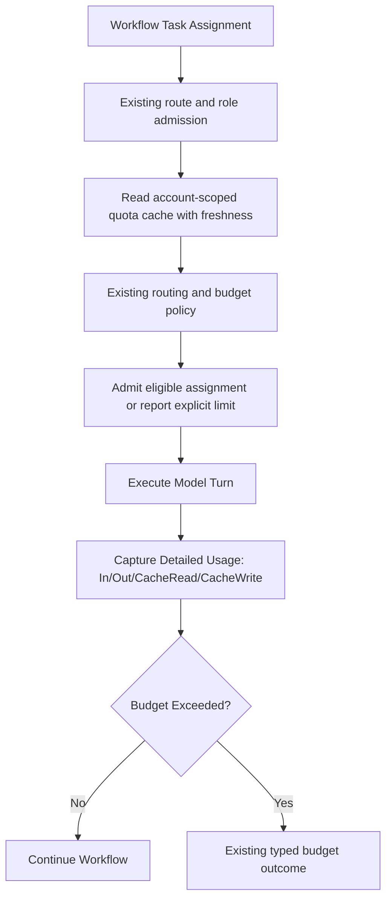

# Plan: Quota-Aware Usage, Rolling Windows, and Cost Limit Tracking

Task Reference: `task_quota_cost_tracking`  
Status: Draft / Proposed  
Tracking: [`plans/implementation-plan.md`](implementation-plan.md)

**Design reference.** This document retains accounting and quota-observation contracts. The [implementation plan](implementation-plan.md) owns decisions, status, owners and phase gates; the [unified plan](plan-unified-kxm-milestones.md) supplies proposed M8 scope/order using M2 usage events and existing Runtime policy. This is not a second routing/budget authority or active backlog.

**Related plans:** [`implementation-plan.md`](implementation-plan.md) (execution tracker);
[`plan-additional-providers-agy-kimi.md`](plan-additional-providers-agy-kimi.md)
(Antigravity / Kimi quota surfaces).

## 1. Objective

Extend KXM's existing usage records, cache-aware pricing and run budget guards with account-scoped quota observations. Keep reported usage, subscription quota, metered cost, equivalent list-cost estimates and unknown values distinct. Quota-informed routing remains subject to existing authenticated/model-capable eligibility and native-route policy; observations cannot guarantee avoidance of rate limits.

---

## 2. Background and Architectural Gap

In KXM today:

- `plugins/kxm/src/routing.ts` already records input/output/cache usage and explicit cost basis. `prices.ts` and the dated, hash-bound `.kxm/prices.yaml` support cache-aware list pricing; the engine checks metered `limits.maxModelCost` before dispatch.
- Accepted A1 verifies catalog hash/staleness on the one-shot estimate path. Broader price-accounting coverage remains open in the canonical tracker; do not reimplement the existing foundation.
- **Remaining gap:** quota limits vary by account, plan, shared pool and provider version. Window names, units and reset semantics require observed source evidence; 5h/7d windows are examples rather than a universal API.
- Fresh quota information can inform an eligible next assignment, but concurrent consumption and provider enforcement can still produce 429s. Missing or stale observations must not appear as unused allowance.

---

## 3. Reference Architecture from Evaluated Repositories

### A. `@latentminds/pi-quotas` (historical reference package)

- **Query pattern:** Provider-specific subscription/usage readers can inform a KXM observation contract. Pi credential access in a reference is not authorization to centralize native harness credentials; source/version/license and endpoint eligibility must be verified before reuse.
- **Provider coverage:** The reference considers several provider quota surfaces; actual supported accounts and fields must be observed, not inferred from a provider name.
- **Window metrics:** Preserve provider-reported utilization, units and absolute reset timestamps, including unavailable values. Do not normalize every account into invented 5h/7d windows.
- **Warning Escalation:** Proactively flags utilization pace (`green` $\to$ `amber` $\to$ `red` $\to$ `critical`).

### B. `pi-antigravity` ([github.com/kontextmind/pi-antigravity](https://github.com/kontextmind/pi-antigravity))

- `/antigravity.usage` monitors Google Cloud Code shared quota groups, remaining quota fractions, and reset schedules.

### C. `pix-models` ([pix-mono/packages/pix-models](https://github.com/kontextmind/pix-mono/tree/main/packages/pix-models))

- Tracks context window size, per-M-token rates, cache read discounts, and coding benchmark rankings.
- Separating cache-read and cache-write usage is useful for accounting. Savings depend on actual rates, cache hits and provider semantics; no universal 80–90% discount applies.

---

## 4. Proposed Changes in KXM



### 1. Unified Quota Monitor Module (`plugins/kxm/src/quotas.ts`)

Candidate module/interface only: use supported native health/usage surfaces and reviewed provider readers behind one KXM install. Credential references remain owned by the authenticated native harness; discovery is not execution admission.

```typescript
export interface ProviderQuotaStatus {
  provider: string;
  accountRef: string;       // Opaque identity, not a credential
  poolRef: string;          // Shared pool or model-specific quota identity
  source: string;
  observedAt: string;
  expiresAt: string;
  state: "known" | "unknown" | "stale" | "error";
  utilizationPercent: number | null;
  windowId: string;         // Source-defined; do not assume 5h/7d
  resetsAt: string | null;
  remaining: { value: number; unit: "tokens" | "requests" | "credits" } | null;
}

export async function getProviderQuota(provider: string, accountRef: string): Promise<ProviderQuotaStatus[]>;
```

### 2. Quota-Aware Predictive Routing in `plugins/kxm/src/routing.ts`

Extend existing routing contracts rather than introducing a separate selector:

- Read an account-scoped cache with freshness, invalidation and bounded retry/backoff; do not query every assignment unconditionally.
- A warning threshold is policy input, not an automatic grant to change provider/model. Any alternate arm must satisfy existing auth, model hosting, role, budget and independence rules. Native exhaustion cannot silently switch the same provider onto Pi's paid API.
- Preserve quota exhaustion and explicit empty-eligible-set outcomes. Unknown estimates do not establish headroom, and proactive warning cannot guarantee that a concurrent request avoids 429.

### 3. Cache-Aware Cost Calculation

Extend the existing price/catalog contracts only where a demonstrated gap remains. For per-million-token rates, a simplified single-tier estimate is:

$$\text{EstimatedCostUsd} = \frac{\text{tokensIn}_{\text{uncached}}P_{\text{in}} + \text{cacheReadTokens}P_{\text{cacheRead}} + \text{cacheWriteTokens}P_{\text{cacheWrite}} + \text{tokensOut}P_{\text{out}}}{10^6}$$

Normalize each provider's token semantics without double counting; context tiers and additional charges may require more terms. Report missing prices as unknown and subscription usage separately from metered charges. List-price estimates are not invoices.

### 4. Stage & Run Budget Guardrails

The existing run guard is `limits.maxModelCost`. A possible finer stage-budget shape is illustrated below, not an implemented or accepted schema; reconcile any extension with the existing workflow compiler and typed budget outcomes before use:

```yaml
stages:
  implement:
    budget:
      maxCostUsd: 1.50
      maxTokens: 350000
      actionOnExceed: "pause_and_escalate" # "pause_and_escalate" | "fail_closed"
```

Any selected stage-budget extension must reuse `engine.ts` accounting and recovery semantics. Do not assume that the sketch's `audit_escalation` checkpoint exists or introduce a separate pause authority. API budget rollover remains deferred by the canonical plan.

---

## 5. Delivery Mapping

M8 contains proposed quota/cache/credential contracts, using M2 usage events and existing price/routing/engine owners. The former stages are replaced by this mapping because cache usage and run-cost guards already exist. Only the implementation plan selects and tracks slices, owners, status and phase gates.

---

## 6. Design Invariants for the Owning Milestones

- Supported quota views identify account/pool, source, units, observation/reset time and freshness; unsupported, revoked and unknown states remain visible.
- Account changes invalidate cached observations; stale data and provider failures exercise bounded backoff without crossing credential ownership boundaries.
- Any failover uses the canonical eligible set and records exhaustion; no color or percentage threshold admits a route.
- Cache-read/write accounting, tiered estimates and budget settlement preserve explicit cost basis and unknown amounts. These invariants do not pass an existing phase gate.
