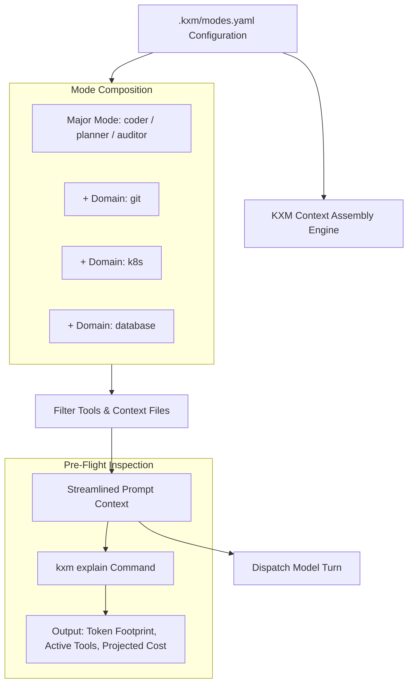

# Plan: Declarative Workflow Modes, Domain Isolation, and `kxm explain`

Task Reference: `task_workflow_modes_explain`  
Status: Draft / Proposed  
Tracking: [`plans/implementation-plan.md`](implementation-plan.md)

**Related plans:** [`implementation-plan.md`](implementation-plan.md) (execution tracker);
archived [`plan-role-configuration-governance.md`](history/plan-role-configuration-governance.md)
(role-seat tool scoping);
[`plan-token-reduction-rtk-ai.md`](plan-token-reduction-rtk-ai.md)
(shell-output compression).

## 1. Objective

Adopt an opinionated, config-driven session composition architecture inspired by `doompi`: introduce declarative Major and Minor modes (`.kxm/modes.yaml`), eliminate schema bloat by selectively loading only role-relevant tools and context, and implement a pre-flight `kxm explain` command to inspect prompt token costs before launching runs.

---

## 2. Background and Architectural Gap

In KXM today:

- Agent setup often dumps the entire repository context (`AGENTS.md`, full guideline documents) and all registered tools/skills into every agent turn.
- **The Problem of Context Bloat:**
  1. **Cognitive Degradation:** Exposing dozens of MCP tool schemas and extensive guidelines causes instruction-following drift and increases tool-hallucination rates.
  2. **Economic Waste:** A simple code-exploration task pays the token tax for database schemas, Kubernetes tools, and complex PR instructions on every single turn.
  3. **No Pre-Flight Cost Visibility:** Operators have no mechanism to audit how much a workflow configuration will cost or how much context it will consume *before* initiating execution.

---

## 3. Reference Architecture: `doompi` (<https://github.com/kontextmind/doompi>)

`doompi` addresses this exact problem with an Emacs-inspired configuration model:

- **"Loads only the skills and tools you name."**
- **Major Modes:** Define the fundamental operational role (e.g. `coder`, `planner`, `auditor`). The major mode determines the base prompt, tool primitives, and permission baseline.
- **Minor Modes / Domains:** Modular, stackable toolkits switched on only when required by the task (e.g. `git`, `docker`, `k8s`, `database`).
- **Pre-Flight `--explain`:** Running `doompi --explain` inspects the configuration matrix and prints exact context token weights, registered schemas, and projected cost per model turn before launch.

---

## 4. Proposed Changes in KXM



### 1. Declarative Mode Configuration (`.kxm/modes.yaml`)

Define major roles and stackable domain modules:

```yaml
# .kxm/modes.yaml
majorModes:
  coder:
    description: "First-pass implementation and bug fixing"
    baseTools: [read, edit, write, bash]
    contextFiles: [AGENTS.md]
    thinkingLevel: medium
  
  planner:
    description: "High-level architectural planning and decomposition"
    baseTools: [read, grep, find]
    contextFiles: [plans/implementation-plan.md]
    thinkingLevel: high

  auditor:
    description: "Security and compliance verification"
    baseTools: [read, grep]
    contextFiles: [SECURITY.md]
    thinkingLevel: high

domains:
  git:
    tools: [git_status, git_diff, git_commit]
    promptSnippet: "Follow git branch conventions; never commit directly to main."

  k8s:
    tools: [kubectl_get, kubectl_describe]
    promptSnippet: "Target local dev cluster; verify namespaces before mutating."

  database:
    tools: [sqlite_query, sqlite_schema]
    promptSnippet: "Database is SQLite at .kxm/state/kxm.db; use read-only queries."
```

### 2. Selective Context Assembly (`plugins/kxm/src/context-packet.ts`)

Refactor context assembly so that only tools and prompt sections explicitly included by the active major mode and enabled domains are loaded into the agent session. Omit all unused MCP schemas and guidelines.

### 3. Pre-Flight `kxm explain` CLI Command

Implement `kxm explain` to inspect prompt overhead and token costs:

```bash
$ kxm explain --mode coder --domains git,database
============================================================
KXM PRE-FLIGHT CONTEXT EXPLAIN
============================================================
Major Mode:      coder
Enabled Domains: git, database
Target Model:    anthropic/claude-sonnet-4.6

CONTEXT BREAKDOWN:
- Base System Prompt:        850 tokens
- Guidelines (AGENTS.md):   1,220 tokens
- Domain Prompts:            310 tokens
- Tool Schemas (6 tools):    940 tokens
------------------------------------------------------------
TOTAL PROMPT FOOTPRINT:     3,320 tokens (1.6% of 200k window)

PROJECTED COSTS:
- Input Turn Cost:          $0.0099
- Cache Read Cost:          $0.0010 (90% savings on subsequent turns)
- Output Turn Estimate:     $0.0150 (1,000 output tokens)
============================================================
```

---

## 5. Execution Stages and Milestones

| Stage | Action | Target Files | Verification Gate |
| :--- | :--- | :--- | :--- |
| **Stage 1** | Implement `.kxm/modes.yaml` parser and schema | `plugins/kxm/src/modes.ts` | Unit tests validate YAML parsing and mode inheritance |
| **Stage 2** | Integrate selective tool filtering in context assembly | [`plugins/kxm/src/context-packet.ts`](../plugins/kxm/src/context-packet.ts) | Test verifies unused tools are stripped from prompt |
| **Stage 3** | Implement `kxm explain` CLI command | [`plugins/kxm/src/commands.ts`](../plugins/kxm/src/commands.ts) | Command prints formatted breakdown with accurate token counts |
| **Stage 4** | Benchmark token reduction against baseline | Benchmark suite | Measure $\ge 40\%$ prompt token reduction on focused tasks |

---

## 6. Acceptance Criteria

- Sessions execute with only the tools explicitly declared in their active modes.
- `kxm explain` accurately calculates token counts and per-turn cost estimates.
- Unused skills and MCP schemas do not appear in the model's system prompt.
- `npm run verify` passes completely.
