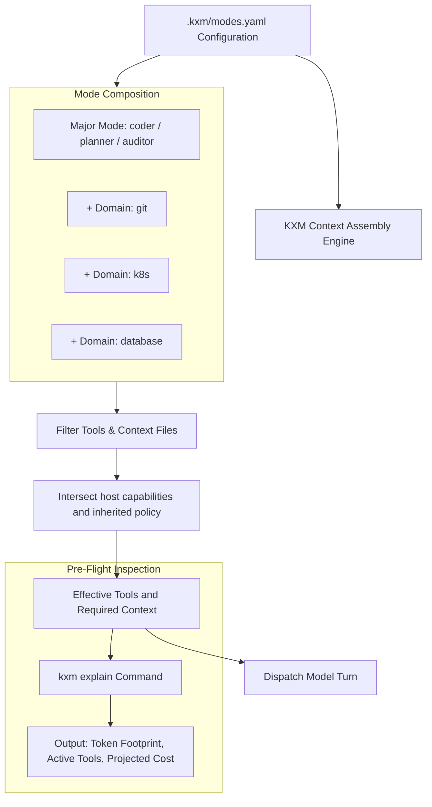

# Plan: Declarative Workflow Modes, Domain Isolation, and `kxm explain`

Task Reference: `task_workflow_modes_explain`  
Status: Draft / Proposed  
Tracking: [`plans/implementation-plan.md`](implementation-plan.md)

**Design reference.** This document retains mode/domain composition and selective activation contracts. The [implementation plan](implementation-plan.md) owns decisions, status, owners and phase gates; the [unified plan](plan-unified-kxm-milestones.md) supplies proposed M1/M6 scope/order with M5 context accounting. Existing parser/explain code is a foundation, not evidence of host tool enforcement. This is not an independent backlog or permission authority.

**Related plans:** [`implementation-plan.md`](implementation-plan.md) (execution tracker);
archived [`plan-role-configuration-governance.md`](history/plan-role-configuration-governance.md)
(role-seat tool scoping);
[`plan-token-reduction-rtk-ai.md`](plan-token-reduction-rtk-ai.md)
(shell-output compression).

## 1. Objective

Connect existing declarative major modes and domains (`.kxm/modes.yaml`) to actual host tool, skill and resource activation. Retain `doompi`'s explicit composition idea and improve existing `kxm explain` so its estimates and omissions describe the effective session. Selective loading must preserve mandatory policy and cannot expand inherited permissions.

---

## 2. Background and Architectural Gap

In KXM today:

- `plugins/kxm/src/modes.ts` and `schemas/vnext/modes.schema.json` already define major modes/domains and resolve tools, context files and prompt snippets. `kxm explain` is registered in `plugins/kxm/src/cli.ts`; the CLI implementation uses the current `cli/` module layout.
- Existing context arbitration and packet assembly also provide bounded context mechanisms; the gap is not the complete absence of scoping or pre-flight inspection.
- **Remaining gap:** metadata composition and explain output do not prove that each native host registers only the intended tools or loads only the selected bundles. M1/M6 must test actual activation and enforcement, while M5 accounts for evidence, omitted context and estimates.
- Unnecessary context can increase token use and obscure instructions. Measure representative tasks rather than asserting a universal quality or cost improvement.

---

## 3. Reference Architecture: `doompi` (<https://github.com/kontextmind/doompi>)

`doompi` addresses this exact problem with an Emacs-inspired configuration model:

- **"Loads only the skills and tools you name."**
- **Major Modes:** Define the operational role (e.g. `coder`, `planner`, `auditor`), requested prompt and tool surface. In KXM, a mode can only narrow the inherited permission floor.
- **Minor Modes / Domains:** Modular, stackable toolkits switched on only when required by the task (e.g. `git`, `docker`, `k8s`, `database`).
- **Pre-Flight inspection:** Explain-style output exposes selected context and schemas before launch. Exact provider token counts and cost require more evidence than configuration inspection; KXM must label estimates and their assumptions.

---

## 4. Proposed Changes in KXM



### 1. Declarative Mode Configuration (`.kxm/modes.yaml`)

The existing `kxm.modes.v1` shape defines major roles and stackable domains. This illustrative configuration is not a guarantee that these tool names exist on every host; activation must map them to admitted host capabilities:

```yaml
# .kxm/modes.yaml
schema: kxm.modes.v1
majorModes:
  coder:
    description: "First-pass implementation and bug fixing"
    baseTools: [read, edit, write, bash]
    contextFiles: [AGENTS.md]
    thinkingLevel: medium
  
  planner:
    description: "High-level architectural planning and decomposition"
    baseTools: [read, grep, find]
    contextFiles: [plans/implementation-plan.md]
    thinkingLevel: high

  auditor:
    description: "Security and compliance verification"
    baseTools: [read, grep]
    contextFiles: [SECURITY.md]
    thinkingLevel: high

domains:
  git:
    tools: [git_status, git_diff, git_commit]
    promptSnippet: "Follow git branch conventions; never commit directly to main."

  k8s:
    tools: [kubectl_get, kubectl_describe]
    promptSnippet: "Target local dev cluster; verify namespaces before mutating."

  database:
    tools: [sqlite_query, sqlite_schema]
    promptSnippet: "Use the configured project database through admitted read-only tools."
```

### 2. Selective Context Assembly (`plugins/kxm/src/context-packet.ts`)

Connect existing mode resolution to host registration and context assembly so selected tools, skill bundles and resources match the effective session. Omit unused optional schemas/context, but retain mandatory instructions, policy and required evidence. `context-packet.ts` handles context; actual tool availability and native restrictions must also be enforced at the adapter boundary. Record unsupported selections and bundle revisions rather than silently pretending they loaded.

### 3. Pre-Flight `kxm explain` CLI Command

Extend existing `kxm explain` through its current CLI owner to describe effective activation, omitted/unsupported resources, estimator identity and price-catalog provenance. The following is an illustrative report shape, not captured output or a verified model price. Counts and costs are estimates; cache savings depend on actual hits and provider rates:

```bash
$ kxm explain --mode coder --domains git,database
============================================================
KXM PRE-FLIGHT CONTEXT EXPLAIN
============================================================
Major Mode:      coder
Enabled Domains: git, database
Target Model:    <observed admitted model id>

ESTIMATED CONTEXT BREAKDOWN (named estimator required):
- Base System Prompt:        850 tokens
- Guidelines (AGENTS.md):   1,220 tokens
- Domain Prompts:            310 tokens
- Tool Schemas (6 tools):    940 tokens
------------------------------------------------------------
ESTIMATED PROMPT FOOTPRINT: 3,320 tokens (illustrative)

PROJECTED COSTS (dated catalog and observed model required):
- Input Turn Estimate:      <estimate or unknown>
- Cache Read Estimate:      <conditional on provider/cache behavior>
- Output Turn Estimate:     <estimate for stated output-token assumption>
============================================================
```

---

## 5. Delivery Mapping

Parser/schema and CLI explain are existing foundations. M1 proposes actual cross-host activation; M6 narrows trusted workflow/tool contracts; M5 accounts for retrieved context and estimates. The former stage table is replaced by this mapping, and the earlier 40% reduction target remains an unmeasured hypothesis. Only the implementation plan selects and tracks slices, owners, status and gates.

---

## 6. Design Invariants for the Owning Milestones

- Effective tools are the intersection of selected modes, inherited policy and admitted host capabilities; fixtures inspect actual registration and execution, not only prompt text.
- Explain output identifies estimators, price provenance, assumptions, unknown costs and omitted/unsupported resources.
- Optional unused skills/schemas are absent while mandatory policy and required evidence remain; loaded bundles have stable identity and revisions.
- Representative measurements compare token use and task outcomes without assuming a fixed reduction. These invariants do not pass a phase gate or authorize a new tool surface.
