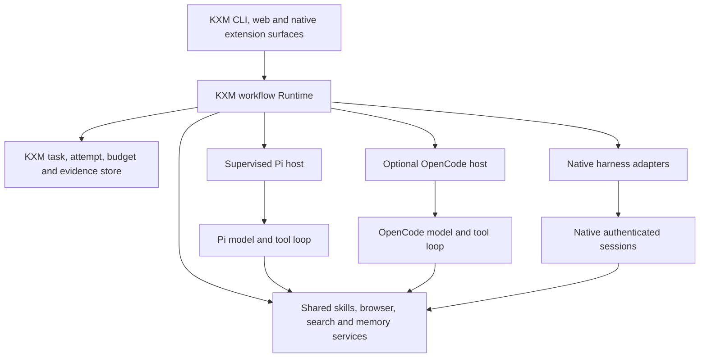
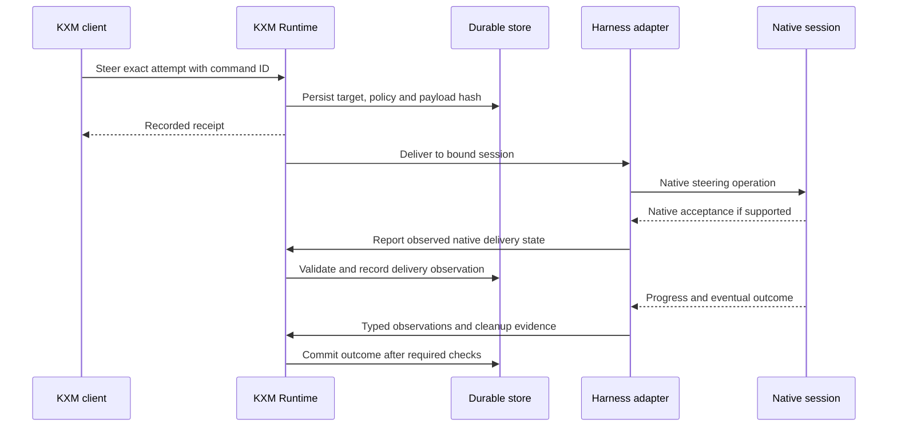

# KXM harness architecture for agentic workflows

## Recommendation

**Build KXM into a unified workflow harness, with its own operator experience and
execution contracts. Retain an existing agent engine underneath it.** Begin with
the existing Pi RPC route, and compare a supervised Pi SDK host with the released
OpenCode SDK before choosing a deeper embedded engine. Adopt selected DeepSeek
Harness designs for capabilities, delegation, tool scheduling and resource
ownership. A three-way source-code merge or a new provider/model loop is not
justified by the available evidence.

This direction gives KXM ownership where its workflows need it: reliable task
handoffs, shared capabilities, permissions, budgets, artifacts, verification,
and recovery. Those responsibilities already overlap KXM's durable Runtime.
Moving them into another complete harness would introduce competing owners for
the same work. KXM can deliver one coherent product while preserving native
Claude, Codex, Grok and other authenticated harness routes.

Pi is the lowest-change starting point because KXM already integrates it. That
is an integration-cost judgment, not a measured claim that Pi is the best engine.
**OpenCode 2.0.3 is a serious alternative for a KXM-owned interactive session
host:** its published SDK, durable inbox, background children, and restart
machinery materially strengthen its case. DSH is particularly useful as an
architectural reference, but its native child adapters and dynamic workflows do
not automatically supply the durable cross-harness workflow guarantees KXM needs.

This report supplies technical evidence for the
[unified plan](plan-unified-kxm-milestones.md), the single proposed M0–M9 scope
and sequence. The [implementation plan](implementation-plan.md) alone records
decisions, execution status, accountable owners and phase-gate acceptance.
No producer admission, phase gate, implementation acceptance or release status
changes as a result of this research.

## Evidence and version boundaries

| System | Exact comparison target | Evidence boundary |
|---|---|---|
| KXM | 0.7.1, commit 5ff9f642 | Historical source inspection and existing planning evidence; current-baseline delta below |
| Pi | 0.85.1, commit d981de12 | Release tag matches npm gitHead and KXM's development dependency |
| OpenCode | 2.0.3, release tag commit d44b52ca | Published @opencode/sdk package metadata, unpacked SDK files, and tagged implementation |
| DeepSeek Harness | Fork commit c291e796, source version 0.1.5-rc.2 | Existing fork snapshot; npm latest observed as 0.1.5-rc.1, so source findings are not a claim about that published version |

Sources were observed September 15 UTC, September 14 in America/Chicago. The
[evidence register](evidence/harness-strategy.json) records full commits, package
observations and source hashes. OpenCode and upstream Pi are comparison sources;
they are outside the historical 29-fork count. The unified register now covers
36 forks after the separate seven-fork memory/Studio review.

The original source citations remain pinned to `5ff9f642`. Current KXM is
`02aaed31`, with accepted A1 bounded async product probes, escalation after child
close, conservative descendant settlement, redacted v2 process evidence and
supervisor rejection handling. Preserve these repairs. Remaining live permission
and broader HTTP lifetime witnesses are recorded in
[Tracking](implementation-plan.md); Phase 11 is not passed. The Pi outcome and
Studio gaps below remain distinct from the already-strict one-shot final path.

An important correction: OpenCode's default dev branch at e03db9bc contains an
older private sdk-next and incomplete V2 operations. It is not the released
2.0.3 implementation. In the release, the SDK is published, interrupt semantics
have changed, and subagent continuation rejects a missing or unrelated child.
The older branch's task-id fallback and unavailable operations must not be used
to judge the released SDK.[^o-sdk][^o-child][^o-execution]

These are source findings, not executed interoperability or performance results.
The report does not establish that any candidate is faster, cheaper, more secure,
or more reliable under KXM workloads. It identifies mechanisms worth testing and
the conditions under which a recommendation should change.

## 1. Separate the three loops

Agentic systems contain several kinds of execution. Treating all of them as
"the agent loop" creates ambiguous ownership and unsafe retries.

| Layer | Work it performs | Proposed owner |
|---|---|---|
| Model step | Assemble context, call model, collect output, execute tools | Selected harness engine |
| Conversation | Queue inputs, steer, compact history, continue a child session | Engine, supervised through a KXM adapter |
| Workflow | Assign roles, coordinate dependencies, bound spend, verify artifacts, retry or reconcile effects | Existing KXM Runtime |

Terminology also differs. Pi calls one assistant response plus its tool calls a
turn; DSH calls that a step and groups multiple steps into a turn. Neither should
be silently equated with a KXM workflow step. Store the native identifiers and
map their meaning explicitly in each adapter.[^p-loop][^d-arch][^k-engine]

The diagram is a proposed ownership model. It does not imply that all these
adapters are currently admitted. Each adapter may expose fewer operations than
another; KXM must report that difference instead of pretending every harness
implements the same protocol.

## 2. Pi: a compact engine boundary KXM can already use

### Composition and execution

Pi's SDK creates an AgentSession around the Agent loop, model runtime, session
manager, settings, resource loader and custom tools. The factory wires provider
streaming, retry settings, context transformations and extension hooks, then
restores session messages when resuming. KXM can supply its resource and tool
selection through this composition boundary instead of editing Pi's loop.[^p-sdk]

The loop has two nested continuations. The inner continuation handles tool calls
and steering inputs; the outer continuation consumes follow-ups after the agent
would otherwise finish. Before the next model request it can prepare context or
change model settings. This is a useful boundary for a KXM context packet or
budget decision, provided the selected public hook actually covers the intended
operation.[^p-loop]

Pi emits incremental assistant and tool events. Streaming is already a core
mechanism, so a KXM UI does not require a custom inference engine. Both RPC and
SDK integration can support a separate process: embedding the SDK in a KXM-owned
worker does not require loading it into the Hub process.[^p-api]

### Scheduling and steering

In 0.85.1, a sequential tool in a response makes the whole tool batch sequential.
Otherwise prepared tool calls run through Promise.all, with final model-visible
results emitted in original order. Responses truncated by the output token limit
do not execute their potentially incomplete tool arguments. These are useful
correctness properties, but tool parallelism alone does not coordinate file
ownership across independently running agents.[^p-tools]

Steering is queued for the next request after the current tool batch. It is not
immediate interruption of an already running shell command. Follow-ups wait for
the agent's natural stopping point. AgentSession keeps pending steering and
follow-up lists in memory; the inspected enqueue path does not durably record
each input before returning. A process loss can therefore create an input
delivery uncertainty that a KXM durable outbox must account for.[^p-queue]

### What to adopt

Use the session factory, incremental events, resource loader, custom tools and
existing compaction/session support. Keep the engine dependency behind one
adapter. A KXM SDK host should rebuild cwd-bound resources on session replacement
and reattach observers, rather than carrying stale project tools into a resumed
session.[^p-api]

Do not assume the SDK solves durable workflow retries, cross-host leases, shared
budgets, or native-provider authentication. KXM currently declares the coding
agent as an optional peer and development dependency. An embedded production
host requires an explicit runtime packaging choice and a tested version range;
the current package declaration is not proof that the engine ships to every
consumer.[^k-package]

**Assessment:** preferred initial engine to evaluate because the integration
already exists. Retain RPC unless the SDK removes a concrete limitation or
materially simplifies ownership. A custom interface by itself is not evidence
that RPC must be replaced.

## 3. OpenCode 2.0.3: a substantial embedded application platform

### Host and service ownership

The released SDK constructs an in-memory HTTP routing boundary and exposes the
same client shape to its host application. It supplies explicit close/disposal,
plugin registration, instance configuration and session/event aliases. The host
owns an Effect runtime, where scoped resources can be shut down together. This
supports a KXM interface without exposing a listening HTTP port.[^o-sdk][^o-host]

"In-memory HTTP" describes transport, not durable storage. The inspected embedded
host defaults its database path to :memory:. A persistent KXM integration must
explicitly select storage, define who owns it, and prove restart behavior.
The SDK also launches its session-recovery sweep during startup, so simply
opening a persisted database can have execution consequences. KXM must control
recovery policy and establish that the previous owner is gone before startup.[^o-host]

An OpenCode host is not eligible for effectful KXM workflows until its automatic
recovery can be gated by KXM's reconciliation decision. Prove this through a
supported configuration or tested service override. If it cannot be controlled,
limit the experiment to isolated read-only work; do not attach that host to an
unreconciled production session database.

The package brings a broader dependency surface than a thin protocol client:
Effect, server/core/schema/plugin packages and native capabilities including
PTY, file search, watching and image processing. This may save implementation,
but it also changes KXM's installation, update and platform matrix. Published
availability is not proof of compatibility with KXM's supported Node versions.[^o-package]

### Durable inbox and per-session execution

Inputs are represented as persisted inbox items, including user inputs and
control work. Steering can be promoted at a step boundary, while queued input
waits for a broader continuation boundary. A per-session coordinator owns active
execution and coalesces wakeups; unrelated session keys can run concurrently.
This is a useful pattern for avoiding two drivers competing for one session.[^o-inbox][^o-coordinator]

The release uses **first-admission-wins** reconciliation for matching session and
item type. The inspected reconciliation predicate does not compare a repeated
request's entire payload. KXM should keep its stricter command-id plus canonical
payload-hash contract: a repeated id with different instructions must be rejected
at KXM's boundary, even when a native engine simply returns the first item.
This is a material difference from the earlier dev implementation.[^o-inbox]

Execution writes a durable claim with the started event and releases it with a
terminal event. Shutdown interruptions retain the claim so restart can find
unfinished work. The recovery implementation explicitly calls its semantics
at-least-once: it can run a continuation again after a crash. It assumes the
previous owner is dead and bounds repeated restart attempts. This is much
stronger than an in-memory task list, but it is not a guarantee against duplicate
external side effects.[^o-execution][^o-restart]

### Streaming, tools and cancellation

The step runner publishes a tool-call event before starting its local execution.
Tool fibers can overlap the remaining provider stream, and the runner joins or
interrupts them before recording terminal step state. It distinguishes missing
provider-hosted results, interrupted local work, retryable transport failures,
and output that has already started. That separation is useful for KXM's
observation and outcome contracts.[^o-step]

Interrupt now acknowledges acceptance before cleanup has settled. The API offers
awaitSettlement for that execution and awaitIdle for the session including
successors. KXM needs the same distinction in its operator experience: "stop
requested" cannot immediately become "all effects stopped." A local fiber
settling still does not, by itself, attest that every external descendant is
gone.[^o-execution]

The bus supports paged durable log reads, replay-to-live following and a Synced
marker. Live/typed publication also uses unbounded queues in the inspected
implementation. KXM should adopt cursor and synchronization semantics while
adding explicit end-to-end queue limits for slow subscribers; a paged database
reader alone does not bound every downstream stream.[^o-bus]

### Child agents and recovery

The released subagent tool validates agent eligibility, delegation depth and
permission before dispatch. A requested child session must exist and belong to
the current parent. A new child starts with fresh context. Background children
are represented through jobs, with completion notifications and recovery data;
continuation can prompt the same child session.[^o-child][^o-job]

This is directly relevant to KXM. Adopt explicit parent binding, fresh-context
defaults, durable job notification identity and the separation of input admission
from starting or joining execution. KXM still needs result evidence bound to its
specific assignment and attempt. A selected final assistant message or a completed
job is not sufficient evidence that the required tests and artifact conditions
passed.[^o-job][^k-engine]

**Assessment:** a credible alternative to Pi for the interactive session host,
especially if persistent background conversations become central. Evaluate it
as a replaceable execution host first. Replacing KXM's workflow Runtime with
OpenCode's session/job machinery would be a larger, separate decision.

## 4. DeepSeek Harness: the strongest source of delegation contracts

### Composition through replaceable services

DSH assembles a tree of Cordis plugins. The loop, session log, tool registry,
model adapters and policy are services contributed by plugins. Profiles and
bundles determine the composition. The main architectural unit is a capability
with a definition, provider and consumer; a browser tool, for example, need not
own the implementation of browser execution.[^d-arch]

That maps well to KXM's one-install objective: ship coherent capability bundles
and let host adapters expose them. Adopt explicit dependencies, scoped
registration, reversible cleanup and capability validation. Avoid importing
Cordis solely to achieve modularity; KXM already has service and producer
boundaries. A package extraction is worthwhile only if its dependency closure
and lifecycle can remain small and independently testable.

DSH's supported applications launch through named profiles. Its TypeScript and
Python SDK routes are clients of a DSH runtime, not evidence that every internal
plugin is a stable public in-process embedding API. A DSH-based KXM host would
need to honor that launch architecture or consciously maintain a separate
composition.[^d-arch]

### The log and the model request

The model context derives from the session log. DSH records accepted system and
user messages, request information, assistant settlements and tool calls/results.
Failed or cancelled assistant attempts can remain in the log without becoming
ordinary model history. Live assistant chunks are separate from the final
committed attempt stream; a crash before settlement can lose those transient
chunks.[^d-arch]

This is a useful distinction for KXM: the operator may watch provisional text,
but workflow decisions should consume committed facts. A partial answer saying
"tests passed" must never pass a gate. Conversely, the disappearance of transient
text after reconnect must not erase a completed tool result or accepted input.

DSH has durable next-step and next-turn inbox projections. Its claim operation
consumes next-step messages and, when appropriate, one queued turn. Splice
validation rejects inconsistent persisted histories and duplicate pending ids.
This is a stronger starting point for recoverable input than a bare in-memory
steering array, although actual recovery across a particular external adapter
still needs separate evidence.[^d-inbox]

### Tool scheduling

DSH schedules tool calls using exclusive barriers and a bounded rolling parallel
pool. It rechecks a tool's execution mode before starting it, records the call,
and commits results in model order. Cancellation stops replenishing the pool and
drains started calls. Internal scheduler faults preserve unresolved call facts
rather than fabricating successful results.[^d-tools]

This offers a concrete improvement over an all-parallel or whole-batch-sequential
choice. KXM could run independent reads concurrently while serializing operations
that mutate the same worktree, browser session or external object. The essential
addition is resource-aware effect classification; a generic "parallel" flag is
not enough to infer that two writes are independent. Apply it to KXM-owned tools
and workflow admissions, while documenting native tool coverage limits.

### Child identity, activation and ownership

The subagent service separates a one-shot owned run from a continuable child.
A continuable child has a stable session identity, a durable descriptor and inbox;
each active period has its own run identity. Provider registration does not own
the lifetime of an already accepted run. Observers receive lifecycle data, while
the run holder owns cancellation and disposal.[^d-child]

These boundaries address common orchestration bugs: unloading a plugin should
not orphan its children, a resumed child should not acquire a different identity,
and a progress observer should not accidentally gain control authority. KXM
should incorporate these requirements into its existing attempt and producer
contracts rather than adding another general subagent manager beside the Runtime.

Capability checks matter more than method names. DSH's inspected Codex and Claude
backends are one-shot native children; both advertise no parent-enforced start
capabilities for the options in that contract. The Codex backend creates an
ephemeral thread; the Claude backend delegates through the official Agent SDK.
Their presence does not make arbitrary tool filtering, inherited context,
structured outputs, or continuable children portable to those routes.[^d-native]

DSH's settlement helper awaits a result and then disposal; a cleanup failure
changes the returned job outcome to failure. KXM should preserve even more
detail: useful output, provider outcome, cleanup evidence and unresolved effects
are separate facts. A cleanup failure must prevent clean success without
discarding the artifact already produced.[^d-settle]

### Dynamic workflows: useful interface, incomplete durable engine

DSH can run model-authored JavaScript with agent, parallel, pipeline, phase and
log functions. One worker thread keeps a synchronous script from blocking the
host. The host tracks pending and published children, closes admission on
termination, and applies bounded disposal. Ordinary child failures may become
null results; infrastructure and contract faults terminate the workflow.[^d-workflow][^d-worker]

The documented limits are decisive for KXM: scripts and intermediate values are
not checkpointed for restart; there is no aggregate model-token budget; and a
worker thread/VM is not a security boundary. A fan-out script that returns a
valid JSON value is also not proof that every required child succeeded.
KXM's verified workflow graph should retain explicit per-child outcomes and
join requirements.[^d-workflow][^d-worker]

**Assessment:** adopt the lifecycle and capability contracts, investigate a small
tool-scheduling extraction, and keep DSH available as an external execution
candidate. Its workflow DSL is a useful design reference. Making that DSL KXM's
authoritative workflow engine would currently surrender recovery and budget
requirements that KXM must instead strengthen.

## 5. Compare the mechanisms that matter

| Concern | Pi 0.85.1 | OpenCode 2.0.3 | DSH c291e796 | KXM decision |
|---|---|---|---|---|
| Custom interface | SDK and RPC | Published embedded SDK and client/server model | Profiles, SDK/runtime and web composition | Own KXM interface independently of engine |
| Pending input | Inspected session queues are in memory | Durable inbox with steer/queue and control work | Durable next-step/next-turn inbox | KXM command journal plus native acceptance evidence |
| Parallel tools | Parallel batch or sequential whole batch | Scoped tool fibers and result publication | Bounded pool with exclusive barriers | Bound concurrency and classify shared resources |
| Child continuation | Host/extension composition required | Existing child sessions plus jobs | Distinct continuable service; backend-dependent | Stable identity, explicit capability and parent binding |
| Restart | Session history available; input uncertainty remains | Durable execution claims and at-least-once recovery | Session persistence; dynamic scripts lack checkpoint recovery | Reconcile effects before admitting retries |
| Stop | Abort plus queued steer semantics | Accepted interrupt separate from settled/idle | Run cancellation plus owned disposal | Show requested, observed and uncertain states |
| Native auth | Pi provider route is its own route | OpenCode provider route is its own route | Some true native child backends | Keep existing native-auth rules |
| Main adoption value | Smallest integration change | Persistent application/session platform | Delegation and service contracts | Select by KXM workload evidence |

The table summarizes inspected mechanisms, not a feature guarantee for every
provider or interface. In particular, streaming inside DSH does not mean its ACP
adapter forwards token chunks: the prior pinned ACP review found committed
message/tool updates. Engine support and exported protocol support are distinct.
See the [DSH adapter audit](reviews/fork-additions/deepseek-harness.md).

## 6. What the inspected KXM baseline owns—and remaining gaps

KXM's Runtime already distinguishes run, step, assignment and attempt states,
tracks effect uncertainty, and binds producer requests to capability and context
data. Its fold has blocked_uncertain and cancelling states; the producer result
can explicitly say that termination cannot be attested. These are valuable
workflow semantics to preserve.[^k-engine][^k-fold]

The gaps are not solved by changing the model engine:

- The one-shot process wrapper collects bounded output until settlement and ends
  stdin after the initial input. It needs a transport abstraction that supports
  incremental observations and, where available, ongoing commands.[^k-process]
- The standalone SubagentManager records spawn/steer/stop state in memory. A
  foreground spawn can immediately receive completed status; steer appends a
  record; stop changes a status. No production-source references to this manager
  outside its own module were found. Treat it as an unintegrated control surface,
  not evidence of functioning cross-harness execution.[^k-subagent]
- Windows process termination in the inspected wrapper falls back to killing
  the direct child. It does not establish descendant containment. This is a
  process-ownership problem whether the host uses Pi, OpenCode or DSH.[^k-process]
- Earlier M0 findings remain: strict Pi final outcomes, truthful UI status,
  redaction and real host activation. A new interface must consume repaired
  contracts rather than hide these gaps.

The practical implication is to consolidate execution under the existing
Runtime, then give it better adapters. A new coordinator with another database,
retry policy and status vocabulary would make these inconsistencies harder to
resolve.

## 7. Proposed KXM execution contract

### One authoritative owner at each boundary

KXM owns the workflow attempt and its permissions, not an engine's entire
internal transcript. The engine owns its native conversation state. The adapter
stores a binding between them, including host, canonical cwd/worktree, native
session, native turn where available, engine version, route identity and KXM
attempt. A connection id is not a session id; a workflow retry is not automatically
a new native session.

Keep native transcripts as engine-owned evidence with references. Build a small
KXM handoff packet containing objective, accepted constraints, current revision,
artifact hashes, tests, unresolved issues and authorized capabilities. Do not
attempt general conversion of Pi, OpenCode and DSH transcripts into a universal
model history. Tool-call ids, compaction and provider-specific state make that
conversion lossy.

### Input receipts and output channels

Use separate lifecycle facts for an input: persisted by KXM, sent to the adapter,
accepted by the native engine, consumed at a known boundary, and settled when a
meaningful result exists. Some adapters cannot observe consumption. Report it as
unknown rather than manufacturing an acknowledgment.

An acknowledgment lost after native acceptance creates a real ambiguity. A
durable KXM outbox alone cannot guarantee exactly-once delivery across that
boundary. Resend only with native idempotency or a reliable status query; otherwise
hold for reconciliation. The same rule applies to a tool that changed an external
system before its result was recorded.

Compute and validate the command payload hash before sending anything to the
native inbox. Keep native event semantics precise: a recorded tool call proves
intent, and an execution-start claim proves that execution was admitted. Neither
alone proves the external action happened or completed. That requires the
corresponding result or an independently observed effect receipt.

Expose channels with precise meanings: assistant text, tool progress,
diagnostics, usage, artifacts and terminal outcome. Preserve native event types
alongside normalized fields. Provider-private reasoning should not be treated as
a required cross-harness channel. KXM should default its shared progress feed to
appropriate user-visible text and tool observations.

A bounded decoder must handle split UTF-8, partial JSON lines, oversized frames,
out-of-order messages and slow consumers. Persist required lifecycle facts;
coalesce or discard explicitly provisional display deltas under pressure. Large
tool output belongs in a bounded artifact, with a preview and hash. Stream
disconnection changes observation health, not automatically task outcome.

### Cancellation and effect reconciliation

Cancellation closes admission for new child work, requests native interruption,
waits for the relevant execution to settle, and then verifies process/resource
cleanup. A timeout with unknown descendants remains uncertain. Releasing a
workspace writer lock merely because a timer expired can let two agents write
the same files at once.

The recovery authority is explicit: only KXM may authorize retry of a KXM
workflow effect, using recorded no-start evidence, verified idempotency or a
reconciled external result. The native engine retains its transcript, but may
not override this decision with its own restart policy. If engine state and
KXM's effect ledger disagree, retain both observations and hold the attempt as
uncertain until reconciled; do not select whichever status looks successful.

Use effect classes at the tool or workflow boundary: read-only, safely repeatable
with an idempotency key, locally reversible with verified preconditions, or
externally uncertain. Recovery decisions follow that classification. A model's
instruction to avoid repeating work cannot replace an effect ledger.

For multiple hosts, retain one KXM admission authority and use host-scoped
execution bindings with an ownership epoch. A disconnected host may still be
running. Fencing must be enforced where the effect occurs; a database lease by
itself cannot stop a stale process that still has filesystem credentials.

## 8. Workflow patterns KXM should support

| Pattern | Useful upstream mechanism | KXM-specific requirement |
|---|---|---|
| Plan → implement → verify → review | Engine roles/tools, child sessions | Gates consume exact artifacts and independent review evidence |
| Parallel repository audit | DSH bounded pool; OpenCode background children | Read-only partitions, bounded fan-out, explicit per-item failures |
| Concurrent code changes | Child sessions, workspace support | Separate worktrees or proven disjoint writes; controlled integration |
| Long-running research or build | Durable inbox, jobs, continuation | Reconnect without losing accepted inputs or duplicating effects |
| Human correction during work | Steer versus queued follow-up | Exact target and receipt; distinguish stop from steer |
| Dynamic decomposition | DSH script-level orchestration | Model proposes a validated graph; Runtime owns execution and joins |
| Harness handoff | Native session adapters | Artifact/context packet; native route and permission checks |

For dynamic workflows, prefer a typed graph proposal whose nodes specify role,
inputs, capability needs, resource ownership, budget and output contract. Validate
the proposal, pin it, and execute it through the existing Runtime. Adaptive
changes should become new validated revisions. This preserves the usefulness of
model-directed decomposition without making arbitrary generated JavaScript the
durable workflow authority.

Not every task needs multiple agents. Parallelize independent work when it saves
elapsed time or supplies useful independent judgment. Keep dependent edits and
verification ordered. A global budget must include child work, retries,
summarization and review; local child limits do not enforce a shared ceiling.
Unknown native costs remain unknown, with explicit admission policy and quota
signals rather than invented dollar precision.

## 9. Build, reuse or fork

| Option | Benefit | Cost and limitation | Recommendation |
|---|---|---|---|
| Extend current Runtime and adapters | Preserves workflow authority and native routes | Adapter conformance still needs substantial work | Do now through existing milestones |
| KXM-owned Pi SDK child host | Controlled tools/resources and custom experience with current engine | Runtime packaging and SDK compatibility; durable delivery still KXM's job | Bounded comparison with current RPC |
| KXM-owned OpenCode SDK host | More built-in persistence, jobs and application services | Larger dependency surface and competing recovery policies | Serious comparison candidate, not yet default |
| DSH profile as an execution backend | Existing service composition and native-child patterns | Preview version, platform gaps, backend capability differences | Conditional trial if a specific workflow benefits |
| Merge/fork all three engines | Maximum implementation freedom | Conflicting sessions, policies, dependency models and update streams | Do not start without a demonstrated unsolved requirement |
| New KXM model/tool loop | Complete behavior ownership | Provider streaming, auth, retries, compaction and compatibility become KXM maintenance | Defer; no present evidence requires it |

The strongest argument for a deeper base is avoided maintenance. If OpenCode
passes KXM's required scenarios with substantially less adapter and lifecycle
code than Pi, selecting it as the default session engine is reasonable. If a
small DSH package can be reused without dragging its entire runtime ownership
into KXM, reuse can be better than rewriting it. Neither decision should be made
from feature counts or assumed implementation effort.

## 10. Language, packaging and project structure

Keep TypeScript for the shared product and adapters. All three candidates make
extensive use of TS/JS, so changing language would not remove their API and
lifecycle dependencies. OpenCode also demonstrates a mixed architecture with
native search and process-related components beneath a TS application. DSH's
native pieces in the audited snapshot are C/Node-API; its Python SDK launches
the same runtime.[^o-package][^d-arch]

Use uv-managed Python for optional document/OCR or other specialist tools when
the corpus comparison demonstrates value. Use an existing native backend or
a small Rust helper for an identified search or process-containment requirement.
Containment support is required before admitting a route that depends on it;
Rust itself is not mandatory if another implementation meets the contract.
The [language trials](research-runtime-language-choices.md) remain applicable.

Preserve the current repository and public package exports initially. Internally,
separate workflow/domain code, harness adapters, shared services and UI. Extract
a package only when it has an independent consumer, version boundary or build
need. One KXM installation can install or manage dependencies without presenting
each internal capability as another extension the user must assemble.

An embedded engine's own session database must have a distinct owner and path
from KXM's workflow database. Store bindings and references between them; do not
let both independently decide whether a workflow attempt passed. Pin engine and
adapter compatibility, verify installed artifacts on supported hosts, and retain
third-party notices for any reused code or bundled dependencies.

## 11. Plan ownership

The [unified plan](plan-unified-kxm-milestones.md) incorporates the proposed
capability, transport, input-journal, context, workflow-budget and operator-view
requirements from §§6–10. It owns their M0–M9 scope, dependencies and sequence;
this report does not maintain a second milestone table. Follow its first product
slice and optional M8 email/SMS scope rather than deriving another delivery
sequence from this research. Consult [Tracking](implementation-plan.md) for
decisions, owners, execution status and phase-gate acceptance.

## 12. Decision experiments

Run the current KXM/Pi RPC route as the baseline. Compare a supervised Pi SDK
host and an OpenCode 2.0.3 SDK host on one identical vertical workflow before
building complete adapters for every feature. Use the same model, credentials,
task revision, effective tools and context where the routes legitimately support
them. When those cannot be held constant, record the confound and do not attribute
the difference to the engine alone.

This is the early subsequent engine decision fixture identified in the unified
sequence, before deeper workflow work depends on a chosen continuation surface;
it is not another first product slice. M9 repeats selected paths against the
release candidate and supported host matrix, rather than postponing the first
comparison until release. Name which operations each selected engine or native
adapter can actually continue; unsupported routes remain one-shot. Retaining
Pi RPC is a valid evidence-based outcome.

The vertical workflow should accept a task, create an isolated child assignment,
stream progress, receive a correction, produce a hashed artifact, run a fixed
verification command, survive a controlled disconnect, and settle cleanup. Use
deterministic transport fixtures for failure cases and a small live workload for
quality/cost; do not turn every test into a paid multi-model comparison.

| Experiment | Required observation | Failure or decision condition |
|---|---|---|
| Input accepted, acknowledgment lost | Restart and reconcile same command id and exact native target | Lost input or silent duplicate delivery fails; unresolvable delivery must be visibly held |
| Conflicting command reuse | Same id with altered payload | KXM rejects before effects, even if native API uses first-write-wins |
| Wrong session, parent or cwd | Request rejected before tools execute | New-session fallback or wrong worktree write fails |
| Slow reader and output flood | Bounded memory/queues; durable outcome and tool evidence preserved | Unbounded growth, early success, or lost committed facts fails |
| Parent cancellation with child processes | No new starts; observed exit/cleanup or explicit uncertainty | Clean cancelled/success while effects remain unknown fails |
| Crash after an external effect | Effect reconciled using receipt/state before retry | Blind repetition of a non-idempotent effect fails |
| Engine startup with an unfinished session | Recovery remains gated until KXM reconciles ownership and effects | Autonomous effectful resumption before KXM admission fails |
| Resume and compaction | Constraints and artifact references preserved; no stale resource binding | Lost authorization boundary or duplicated tool action fails |
| Background child completion | One observable completion identity across reconnect/restart | Duplicate parent action or orphaned notification fails |
| Package installation and upgrade | Actual packed package runs with pinned engine on intended hosts | Hidden required extension, missing native asset or unrecoverable migration fails |

Record time to first useful event, total verified completion time, peak memory,
artifact size, input/output/cache tokens where available, reported versus unknown
cost, retries, rework, and the integration changes each engine requires. Set
workload-specific performance targets before running comparisons. Correctness
and permission gates are mandatory; a speed gain cannot compensate for a failed
ownership or effect-recovery contract.

Choose a deeper engine dependency only if it removes a named limitation or
reduces demonstrated maintenance while passing the required scenarios. Consider
a full custom engine only after supported SDKs, protocol adapters and small
upstream contributions cannot meet an essential requirement—and after budgeting
for provider compatibility, session migration and security maintenance.

## Sources

Pinned source links below are implementation evidence. Full hashes and package
metadata are in the [evidence register](evidence/harness-strategy.json). The
existing [streaming research](research-harness-streaming-capabilities.md) and
[four-fork supplement](research-additional-forks.md) provide additional adapter
and distribution detail.

[^p-api]: Pi, 0.85.1, SDK and session lifecycle documentation. [Source](https://github.com/earendil-works/pi/blob/d981de1229ef899957bbe968bc8dcda02a21f477/packages/coding-agent/docs/sdk.md#L1-L200)
[^p-sdk]: Pi, 0.85.1, session factory and provider/extension wiring. [Source](https://github.com/earendil-works/pi/blob/d981de1229ef899957bbe968bc8dcda02a21f477/packages/coding-agent/src/core/sdk.ts#L306-L410)
[^p-loop]: Pi, 0.85.1, model/tool/steering loop. [Source](https://github.com/earendil-works/pi/blob/d981de1229ef899957bbe968bc8dcda02a21f477/packages/agent/src/agent-loop.ts#L156-L272)
[^p-tools]: Pi, 0.85.1, truncated calls and sequential/parallel scheduling. [Source](https://github.com/earendil-works/pi/blob/d981de1229ef899957bbe968bc8dcda02a21f477/packages/agent/src/agent-loop.ts#L375-L560)
[^p-queue]: Pi, 0.85.1, AgentSession input queues. [Source](https://github.com/earendil-works/pi/blob/d981de1229ef899957bbe968bc8dcda02a21f477/packages/coding-agent/src/core/agent-session.ts#L1380-L1452)
[^o-sdk]: OpenCode, 2.0.3, Promise SDK ownership and registration. [Source](https://github.com/anomalyco/opencode/blob/d44b52ca66b6bf69626c0384626d1a9cd9555977/packages/sdk/src/promise.ts#L1-L69)
[^o-host]: OpenCode, 2.0.3, embedded host storage and startup recovery. [Source](https://github.com/anomalyco/opencode/blob/d44b52ca66b6bf69626c0384626d1a9cd9555977/packages/sdk/src/internal/host.ts#L16-L64)
[^o-package]: OpenCode, 2.0.3, core dependency inventory. [Source](https://github.com/anomalyco/opencode/blob/d44b52ca66b6bf69626c0384626d1a9cd9555977/packages/core/package.json#L101-L150)
[^o-inbox]: OpenCode, 2.0.3, durable inbox admission and matching. [Source](https://github.com/anomalyco/opencode/blob/d44b52ca66b6bf69626c0384626d1a9cd9555977/packages/core/src/session/inbox.ts#L44-L201)
[^o-coordinator]: OpenCode, 2.0.3, per-session execution coordinator. [Source](https://github.com/anomalyco/opencode/blob/d44b52ca66b6bf69626c0384626d1a9cd9555977/packages/core/src/session/run-coordinator.ts#L1-L196)
[^o-execution]: OpenCode, 2.0.3, execution claim and interruption contracts. [Source](https://github.com/anomalyco/opencode/blob/d44b52ca66b6bf69626c0384626d1a9cd9555977/packages/core/src/session/execution.ts#L18-L176)
[^o-restart]: OpenCode, 2.0.3, restart assumptions and at-least-once semantics. [Source](https://github.com/anomalyco/opencode/blob/d44b52ca66b6bf69626c0384626d1a9cd9555977/packages/core/src/session/execution/restart.ts#L23-L98)
[^o-step]: OpenCode, 2.0.3, tool publication, execution and settlement. [Source](https://github.com/anomalyco/opencode/blob/d44b52ca66b6bf69626c0384626d1a9cd9555977/packages/core/src/session/runner/step.ts#L64-L215)
[^o-bus]: OpenCode, 2.0.3, durable replay and live event bus. [Source](https://github.com/anomalyco/opencode/blob/d44b52ca66b6bf69626c0384626d1a9cd9555977/packages/core/src/bus.ts#L148-L200)
[^o-child]: OpenCode, 2.0.3, subagent tool and parent-bound continuation. [Source](https://github.com/anomalyco/opencode/blob/d44b52ca66b6bf69626c0384626d1a9cd9555977/packages/core/src/tool/plugin/subagent.ts#L73-L221)
[^o-job]: OpenCode, 2.0.3, child jobs and completion selection. [Source](https://github.com/anomalyco/opencode/blob/d44b52ca66b6bf69626c0384626d1a9cd9555977/packages/core/src/session/subagent-job.ts#L16-L58)
[^d-arch]: DeepSeek Harness, c291e796, composition, turn flow and log architecture. [Source](https://github.com/kontextmind/deepseek-harness/blob/c291e7961a515f6d7af9304e7fd1d257929aef26/docs/architecture.md#L9-L131)
[^d-inbox]: DeepSeek Harness, c291e796, durable inbox projection and claim. [Source](https://github.com/kontextmind/deepseek-harness/blob/c291e7961a515f6d7af9304e7fd1d257929aef26/packages/core/agent-loop/src/inbox.ts#L20-L125)
[^d-tools]: DeepSeek Harness, c291e796, bounded tool pool and exclusive barriers. [Source](https://github.com/kontextmind/deepseek-harness/blob/c291e7961a515f6d7af9304e7fd1d257929aef26/packages/core/agent-loop/src/tool-calls.ts#L41-L170)
[^d-child]: DeepSeek Harness, c291e796, one-shot/continuable service ownership and capabilities. [Source](https://github.com/kontextmind/deepseek-harness/blob/c291e7961a515f6d7af9304e7fd1d257929aef26/packages/subagent/subagent/src/index.ts#L1-L27) [Source](https://github.com/kontextmind/deepseek-harness/blob/c291e7961a515f6d7af9304e7fd1d257929aef26/packages/subagent/subagent/src/types.ts#L31-L200)
[^d-native]: DeepSeek Harness, c291e796, native Codex and Claude one-shot providers. [Source](https://github.com/kontextmind/deepseek-harness/blob/c291e7961a515f6d7af9304e7fd1d257929aef26/packages/subagent/subagent-codex/src/index.ts#L1-L108) [Source](https://github.com/kontextmind/deepseek-harness/blob/c291e7961a515f6d7af9304e7fd1d257929aef26/packages/subagent/subagent-claude-code/src/index.ts#L1-L124)
[^d-settle]: DeepSeek Harness, c291e796, result and disposal settlement. [Source](https://github.com/kontextmind/deepseek-harness/blob/c291e7961a515f6d7af9304e7fd1d257929aef26/packages/subagent/subagent/src/run-settlement.ts#L29-L75)
[^d-workflow]: DeepSeek Harness, c291e796, dynamic workflow contracts and limitations. [Source](https://github.com/kontextmind/deepseek-harness/blob/c291e7961a515f6d7af9304e7fd1d257929aef26/packages/workflow/workflow/README.md#L26-L131)
[^d-worker]: DeepSeek Harness, c291e796, worker isolation and host disposal. [Source](https://github.com/kontextmind/deepseek-harness/blob/c291e7961a515f6d7af9304e7fd1d257929aef26/packages/workflow/workflow-worker-thread/README.md#L26-L110) [Source](https://github.com/kontextmind/deepseek-harness/blob/c291e7961a515f6d7af9304e7fd1d257929aef26/packages/workflow/workflow-worker-thread/src/host.ts#L175-L260)
[^k-package]: KXM, 5ff9f642, package exports and dependency ownership. [Source](https://github.com/kontextmind/kxm/blob/5ff9f642e82d7a1e52aeab9245282d89560bb535/package.json#L1-L128)
[^k-engine]: KXM, 5ff9f642, producer/attempt contracts and execution engine. [Source](https://github.com/kontextmind/kxm/blob/5ff9f642e82d7a1e52aeab9245282d89560bb535/plugins/kxm/src/engine.ts#L113-L165)
[^k-fold]: KXM, 5ff9f642, workflow state and effect uncertainty. [Source](https://github.com/kontextmind/kxm/blob/5ff9f642e82d7a1e52aeab9245282d89560bb535/plugins/kxm/src/engine-fold.ts#L9-L123)
[^k-process]: KXM, 5ff9f642, one-shot process transport and termination. [Source](https://github.com/kontextmind/kxm/blob/5ff9f642e82d7a1e52aeab9245282d89560bb535/plugins/kxm/src/oneshot-process.ts#L24-L164)
[^k-subagent]: KXM, 5ff9f642, in-memory subagent manager. [Source](https://github.com/kontextmind/kxm/blob/5ff9f642e82d7a1e52aeab9245282d89560bb535/plugins/kxm/src/subagent-control.ts#L120-L275)
