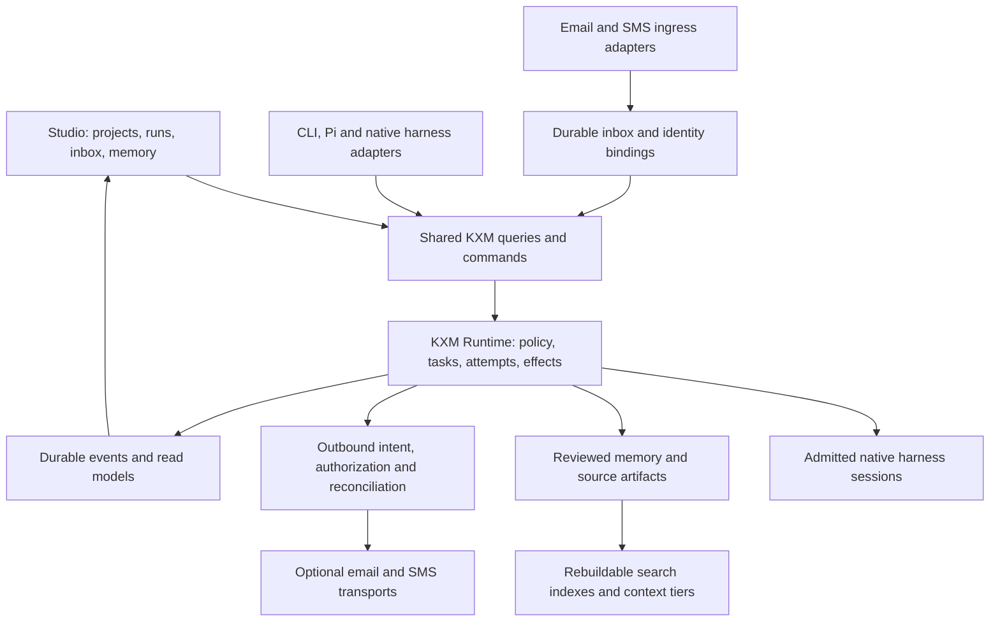

# KXM memory, Studio and coordinator inbox architecture

## Recommendation

**Build a KXM Studio over the existing Runtime, shared memory and communication
services. Give persistent coordinator identities their own internal inboxes;
add email and SMS through optional transport adapters.** Keep the identity,
message history and reviewed knowledge independent of whichever model, harness
or machine executes the next task.

The seven new forks increase review coverage from 29 to 36. Their most useful
contributions are retrieval and provenance design, task and inbox interaction,
schema-based editing, and explicit communication lifecycles. They reinforce
the earlier [harness strategy](research-kxm-harness-strategy.md): KXM should own
the workflow experience while native engines retain their sessions and
authentication. No reviewed repository justifies replacing the current Runtime
or merging several independently authoritative schedulers.

The [unified plan](plan-unified-kxm-milestones.md) owns the single proposed
M0–M9 scope and sequence. The [implementation plan](implementation-plan.md) alone
records decisions, execution status, accountable owners and phase-gate acceptance.
This packet retains architecture and source evidence; it does not
provision addresses, phone numbers, services, native workers or a public Studio.

## Seven forks, one by one

### OpenViking — memory and provenance

The strongest memory reference in this batch: hierarchical retrieval, progressive
detail tiers, extraction stages and a Studio view showing what a session added,
changed or deleted. Adapt those behind KXM's existing arbiter and reviewed memory.
Explicitly map project/agent sharing; peer score penalties are not isolation.
Its AGPL server and mixed Python/C++/Rust runtime make wholesale adoption a
separate decision. **Primary packets: M5/M7, supported by M1/M6/M9.**
[Detailed review and pinned sources](reviews/memory-studio-forks/OpenViking.md).

### ruflo — search, recovery and coordinator contracts

Useful implemented retrieval and projection mechanisms coexist with weaker
durability paths: hybrid writes are not atomic, some guard behavior permits
mutation when a guard is absent, and the coordinator inbox reference is
explicitly non-durable. Adapt scoped lexical/vector retrieval, backup/recovery
checks and addressable coordinator contracts. Keep KXM's reviewed authority and
transactional admission. **Primary packets: M5/M6, with M3/M7 inbox work.**
[Detailed review and pinned sources](reviews/memory-studio-forks/ruflo.md).

### dsh-web — taskboard and harness-management interaction

Its taskboard, continuation controls and capability workshop are concrete Studio
references. The task ledger has real persistence and deduplication, but model
selection can fail and continue with a default; task completion relies on weaker
turn/timestamp correlation than KXM needs. The board's inspected action union
does not include execution cancel. Adapt interaction patterns with exact native
targets and real KXM receipts. Defer its separate scheduler and full-control
remote pairing model. **Primary packets: M2/M3/M7, with M0/M1/M6 foundations.**
[Detailed review and pinned sources](reviews/memory-studio-forks/dsh-web.md).

### Yao — task services, coordinator notices and human questions

Yao provides substantial server-side task, robot workflow, workspace, inbox and
messaging implementations, including a real Twilio SMS path. It is useful for
durable question/answer UX and notices tied to affected work. Its model-generated
result enrichment can default missing status to completed, and some persistence
or stream failures are softened; retain KXM's stronger outcome contracts.
The complete client is built separately, and the license is modified Apache
with additional conditions. **Primary packets: M2/M3/M7/M8; adapt patterns in TS.**
[Detailed review and pinned sources](reviews/memory-studio-forks/yao.md).

### Reactive Resume — Studio authoring and previews

The relevant contribution is editor architecture: shared schemas, explicit forms,
serialized autosaves, visible save failures, last-valid previews and coordinated
exports. Its normal full-document autosave lacks the revision check present in
its separate patch route, and public visibility is not an approved immutable
release. Use mandatory revision checks and KXM's draft/review/activation boundary.
It supplies no agent orchestration or memory engine. **Primary packets: M6/M7,
supported by M0/M1/M9.**
[Detailed review and pinned sources](reviews/memory-studio-forks/reactive-resume.md).

### Agentic Inbox — mailbox ownership and web triage

Separate durable mailbox and email-agent objects illustrate how an address can
outlive the worker serving it. Its thread, draft and chat views are useful for a
coordinator inbox. Replace the inspected best-effort wake path and premature
Sent state with durable intake/outbox records. Built-in chat drafting is not
proof that every MCP send path enforces approval. This fork has no SMS
implementation. **Primary packets: M3/M7/M8, with M2/M5/M6 contracts.**
[Detailed review and pinned sources](reviews/memory-studio-forks/agentic-inbox.md).

### AgenticMail — persistent agent communications

The closest match to a coordinator owning an inbox and optional phone route.
Adapt stable accounts, selective/grouped wakes, thread context and operation-level
provider capabilities. Fix the architectural gaps before reuse: last-active
session mapping is too broad; the paused-agent check does not cover one bridge
resume path; some memory writes can look successful without durable storage;
send timeouts need uncertainty handling. SMS is specifically 46elks direct-send
or Google Voice pending/manual in the inspected registry; phone support does
not imply the same SMS support. **Primary packets: M3/M5/M7/M8.**
[Detailed review and pinned sources](reviews/memory-studio-forks/agenticmail.md).

## Current KXM baseline and immediate implications

This batch compares against KXM **02aaed31**, rather than the previous **5ff9f64**.
The new Phase 11 A1 slice has accepted async bounded probes, termination
escalation after child close, conservative descendant settlement, bounded and
redacted v2 process evidence, and supervisor rejection handling. Do not reopen
those as untouched defects. Live Claude write-refusal evidence, broader HTTP
lifetime decoupling and some price-catalog coverage remain open; Phase 11 is
not passed. Earlier reports retain their original observation revision.
[Current Tracking](https://github.com/kontextmind/kxm/blob/02aaed31fd6160a78378c677ab27d4119f039621/plans/implementation-plan.md#L917-L956).

The relevant memory and Studio code was not changed by that slice:

- **Memory already has governance.** Authored Markdown, candidates, provenance,
  lifecycle, role-aware context, revision pinning and harness projections are
  existing foundations. However, memory body content still bypasses the summary
  redaction path. Fix persistence and existing records before bringing email or
  document bodies into the memory explorer.
  [Memory write path](https://github.com/kontextmind/kxm/blob/02aaed31fd6160a78378c677ab27d4119f039621/plugins/kxm/src/memory.ts#L239-L280).
- **Studio is currently an early shell.** Its CLI launch provides a workflow
  plan but no live state provider or mutation callback. The server reports
  success even without a callback. It polls every three seconds, and parts of
  its HTML rendering interpolate labels. A richer visual design needs real
  command/state wiring, safe text rendering and truthful statuses first.
  [CLI wiring](https://github.com/kontextmind/kxm/blob/02aaed31fd6160a78378c677ab27d4119f039621/plugins/kxm/src/cli/tasks.ts#L281-L327),
  [mutation fallback](https://github.com/kontextmind/kxm/blob/02aaed31fd6160a78378c677ab27d4119f039621/plugins/kxm/src/studio-layout.ts#L410-L430),
  [rendering and polling](https://github.com/kontextmind/kxm/blob/02aaed31fd6160a78378c677ab27d4119f039621/plugins/kxm/src/studio-layout.ts#L792-L874).
- **Durable event and command primitives already exist.** Run acceptance checks
  workflow/prompt identity and commits its event and command record in a
  transaction. Supervisor event reads support an `after` sequence with a page
  limit. The older hub also has authenticated operations snapshots and live
  SSE. Integrate these deliberately; do not assume that the operations SSE is
  already a complete, durable vNext run stream.
  [Run acceptance](https://github.com/kontextmind/kxm/blob/02aaed31fd6160a78378c677ab27d4119f039621/plugins/kxm/src/runtime-service.ts#L354-L440),
  [event paging](https://github.com/kontextmind/kxm/blob/02aaed31fd6160a78378c677ab27d4119f039621/plugins/kxm/src/runtime-supervisor.ts#L525-L537),
  [operations SSE](https://github.com/kontextmind/kxm/blob/02aaed31fd6160a78378c677ab27d4119f039621/plugins/kxm/src/hub.ts#L1395-L1427).

## Target architecture

### Ownership and identity

The proposed persistent **coordinator** is an agent identity with a purpose,
scope and authority ceiling. It is not an always-running model process. Most
messages can be stored, classified by deterministic rules, or grouped without
paying for a model turn. A native model is assigned when work is admitted.

Keep these concepts distinct, extending existing schema owners only where a
reviewed gap exists:

| Identity | Meaning and lifetime |
|---|---|
| Project and repository binding | Approved workspace identity, independent of local path spelling. |
| Coordinator | Persistent role and permissions; survives model replacement or pause. |
| Channel binding | Internal address, email alias or phone route owned by that coordinator and project. |
| Conversation | Related messages, with explicit cross-channel links; never inferred solely from a subject or sender. |
| Task/run/attempt | Work accepted by KXM, with evidence and settlement. |
| Native session/turn | Harness-specific execution target on a known host and working directory. |

Do not create one phone number per temporary subagent. Begin with a primary
coordinator per selected project or workspace, internal inboxes for delegates,
and optional public aliases for the coordinators that need them. A shared
operator number can route notifications initially. Dedicated numbers become a
configuration option when inbound routing or separate personas justify them.
This is a product recommendation, not a selected provider or purchase.

### Shared memory and retrieval

Maintain three kinds of data with different authority:

1. **Evidence:** messages, source documents, artifacts and observed run events.
   Keep source identity, revision/hash, scope and acquisition metadata.
2. **Candidates and reviewed knowledge:** proposed summaries, corrections,
   skills and decisions. Activation follows KXM's existing review path and
   applies to future runs; a retrieval score cannot grant authority.
3. **Derived representations:** lexical/vector indexes, short abstracts, larger
   summaries and cached context packets. They can be rebuilt and invalidated
   without becoming a second source of truth.

Use one retrieval request across CLI, MCP and Studio: caller/project/role,
query, permitted scopes, pinned memory revision and budget. Return source IDs,
selected detail tier, provenance, inclusion reason, omissions and index health.
Search should filter authorized scope before ranking and before fetching bodies.
KXM's existing arbiter already provides deterministic ordering, contradiction
priority and a budget floor; extend it rather than replacing those contracts.
[Current arbiter](https://github.com/kontextmind/kxm/blob/02aaed31fd6160a78378c677ab27d4119f039621/plugins/kxm/src/arbiter.ts#L120-L213).

Start with metadata/summary/full-source tiers and a lexical baseline. Evaluate
hierarchy and embeddings against the same query set before making them default.
Keep factual confidence, access frequency, freshness and task relevance as
separate fields. Repeatedly retrieving a false statement must not make it
verified. Cross-agent sharing is an explicit scope policy, not a lower ranking
weight for private material.

Learning and deletion require durable operations. Record extraction input hash,
extractor version, candidate output and index status. A crash between stores
must leave resumable work, not an apparently completed write. Tombstones must
win over delayed extraction and index rebuilds. Define separately what is
forgotten from active recall, removed from caches, retained as audit metadata,
or remains in Git/backups; a deleted search row alone is not complete erasure.

### Studio information architecture

The first useful Studio should answer what is happening, what needs attention,
and what evidence supports it. Navigation should reflect KXM's actual objects:

| View | Questions it answers | Mutations through shared commands |
|---|---|---|
| Projects | Which workspace, repositories, Runtime and native hosts are connected? | Bind or change reviewed configuration. |
| Workflows | What will run, with which roles, tools, budgets and gates? | Save a revisioned draft; validate; request activation. |
| Runs | Where is work waiting, which attempt owns it, and what changed? | Start, cancel, signal or steer only when supported. |
| Coordinators and inbox | Who owns this message, was a wake admitted, and what task/reply followed? | Assign, pause, draft, approve or send within policy. |
| Memory | What is known, where did it come from, and what did this run propose? | Correct, propose, review, supersede or forget with receipts. |
| Artifacts and settings | What can be inspected/exported; which capabilities need setup? | Revision-bound edits, exports and scoped configuration. |

Use lists and detail panels first, then a graph for workflow dependencies and a
timeline for attempt history. A diagram is a projection of the compiled plan;
dragging a node edits a draft, not a running scheduler. Keep execution status,
operator disposition and visual layout in separate state fields. A board card
drag cannot turn a failed run into a passed one.

Show drafts as locally pending until acknowledged, and distinguish saved from
validated and activated. Use optimistic revision checks so two tabs cannot
silently overwrite each other. Templates, forms and graph edits should compile
to the same canonical workflow contract and receive the same diagnostics as CLI
edits. Store layout/preferences separately from execution policy.

Extract the embedded HTML from `studio-layout.ts` into build-time assets and a
thin serving adapter as the UI grows. Prefer typed feature modules for queries,
commands and projections under existing owners; do not reorganize the entire
repository before the first working vertical slice. Ship static assets in the
KXM package without launching a development server or package installer on use.

### Live streams and cross-harness handoffs

Use two observable layers: durable lifecycle/effect events and bounded live
progress such as token deltas. The latter can be coalesced or dropped with an
explicit gap notice; a terminal result, approval or effect receipt cannot be.
Large allowed output belongs in a referenced artifact, not every browser's
memory or every model prompt.

A Studio connection starts from a snapshot with an event watermark, replays
subsequent authorized events, then follows live updates. A slow tab has bounded
buffers; an expired cursor forces snapshot recovery. Revoked project access
must also revoke an existing stream. Reconnection never automatically resends
a mutation. Incoming steering uses the same persisted/sent/accepted/consumed/
settled distinction described in the harness study.

Persistent inbox ownership makes handoff robust: when a native session is
unavailable, keep the message and task pending with a visible reason. Bind any
resume to the exact coordinator, project, host, cwd, session and attempt. A
new harness can receive a bounded context packet and artifact references;
that is a new execution assignment, not a claim to have migrated an arbitrary
native conversation.

## Coordinator inbox, email and SMS design

### Intake and wake policy

```mermaid
flowchart LR
    I[Inbound message] --> V[Validate transport and address binding]
    V --> P[Persist envelope and source; deduplicate]
    P --> Q[Inbox: unassigned, queued or paused]
    Q --> W[Wake policy and budget]
    W --> K[KXM accepts task or exact-session input]
    K --> D[Draft response]
    D --> A[Standing send policy or exact approval]
    A --> O[Durable outbound intent]
    O --> S[Provider submission]
    S --> R[Accepted, delivered, failed or unknown receipt]
```

Accepting a webhook means the message is durably stored, not that a model was
woken. Use provider/account/event identifiers plus content identity to detect
duplicates and conflicting retries. Store authoritative envelope recipients
separately from display headers. A message to a paused coordinator remains in
its inbox; pause should not destroy knowledge or silently discard work.

Wake rules should cover direct assignment, mentions, CC, known senders,
quiet hours, urgency, loop suppression and per-conversation budgets. The first
actionable message may wake immediately; later messages can be grouped into
one bounded catch-up turn. Persist the group, deadline and reason. Provide a
visible explanation when a wake is skipped, delayed or blocked by missing auth.

The Runtime owns wake admission and scheduling. Timers or SSE callbacks merely
notify it that durable work may be ready. Where ingress storage and Runtime
storage differ, commit the message and a dispatch intent together, then retry
that intent with the same strict command identity until KXM acknowledges it.
Do not claim a transaction spans SQLite, a remote mailbox and a native harness.
Pausing a coordinator must block both new starts and existing-session resumes.

Internal agent communication can use the Runtime directly. It should not need
an SMTP round trip or paid SMS to coordinate two KXM workers. Email and SMS
are transport adapters for outside communication and operator reachability.

### Reply authority and reliable delivery

Owning an inbox does not grant permission to send arbitrary messages. Configure
standing authorization by coordinator, purpose, recipient set, channel and
spending limits. Actions outside that scope create a concrete draft for review.
Bind approval to the normalized recipients, subject/body, attachments and task
revision; editing them invalidates that approval.

External message content is evidence. A matching From address, quoted approval,
subject tag or bare SMS "yes" cannot elevate permissions. For higher-impact
actions, use an authenticated Studio approval with the exact pending action;
SMS can notify and link to it. Any future reply-based approval needs verified
sender binding, action correlation, expiry and replay protection. Keep natural
language intent parsing separate from authorization.

Persist an outbound intent before contacting the provider. A timeout after
submission is **unknown** until reconciled. Reuse provider idempotency/status
when available; otherwise hold for review rather than resend blindly. Delivery
callbacks can arrive late or out of order, so settlement must be monotonic and
retain original provider observations. A provider accepted response is not
proof of recipient delivery or reading.

Communication needs its own reviewed outbox/receipt schema. KXM's current gate
effect verifier specifically validates gate attempt/evidence rows; do not insert
mail events into that namespace or interpret it as a generic send service.
Preserve the same uncertainty discipline and Runtime ownership.
[Gate evidence contract](https://github.com/kontextmind/kxm/blob/02aaed31fd6160a78378c677ab27d4119f039621/plugins/kxm/src/engine-evidence.ts#L35-L84).

### Scope boundary

The [unified sequence and M8 scope](plan-unified-kxm-milestones.md) place internal
intake before optional external email/SMS. This packet defines transport and
authorization contracts, not a separate implementation sequence. SMS notification
and inbound routing remain distinct capabilities; receiving text does not grant
approval authority. Voice, broad autonomous correspondence and managed mail-server
deployment require separate workload and operational evidence before selection.

## Runtime language and distribution implications

Keep TypeScript for KXM's contracts, Runtime adapters, communication providers
and Studio. Neither HTTP streaming, email routing nor a web editor requires a
language migration. Python becomes useful where an evaluated parser or memory
component adds capability; uv can manage its pinned environment. Rust is a
candidate for measured search or process-containment needs. Neither choice
removes cross-store consistency, approval or delivery ambiguity.

An optional component needs explicit version/asset identity, setup, health,
rollback and removal. Regular task execution must not download code or mutate
harness installations. Review actual component licenses before source reuse;
architectural inspiration and dependency redistribution are different choices.
Keep the existing [L1–L6 trials](research-runtime-language-choices.md) and qualify
the actual KXM tarball and optional assets under M9.

## Decision evidence for the unified plan

The [unified M0–M9 plan](plan-unified-kxm-milestones.md) incorporates these
requirements into its milestone sections and defines the first product slice.
This report retains technical fixtures and measurements, not an additional
milestone/owner table or delivery sequence. [Tracking](implementation-plan.md)
alone records decisions, owners, status and phase-gate acceptance. No fixture
below relaxes native-harness admission.

### Boundary and recovery fixtures

- **Truth and identity:** missing handlers never succeed; malicious labels remain
  text; secrets are absent from persisted/displayed bodies; accepted A1 behavior
  remains intact. Clean packages work without optional transports or task-time
  asset installation, with exact capability and coordinator identity.
- **Intake and replay:** restart at each intake/wake/dispatch/event boundary;
  duplicate message IDs recover one message and one admitted task, while changed
  payloads conflict. Exercise expired cursors, revoked access and bounded slow
  clients without losing terminal events or repeating commands.
- **Binding and wake policy:** two projects and two sessions on one harness cannot
  cross-route. Pause blocks both fresh starts and bridge resumes; absent native
  routes remain pending. Grouped wakes obey the recorded deadline and budget.
- **Memory and editing:** use a fixed scoped relevance corpus, authorization before
  ranking, bounded context, crash/rebuild fixtures and deletion tombstones. Conflicting
  editors, rejected schemas, stale approvals and changed attachments cannot activate
  workflows or send. Refresh preserves drafts/decisions; UI and CLI share receipts,
  and graph/timeline views agree with the Runtime projection.
- **External delivery and distribution:** test duplicate ingress, changed-payload
  retries, provider timeouts, reordered callbacks, sender binding and disabled
  accounts. Qualify selected platform assets, provenance, rollback/removal and
  admitted native/provider routes; skipped checks remain explicit.

Use deterministic no-model fixtures for data/recovery contracts and bounded admitted
native runs for execution evidence. The internal fixture does not pass Phase 11;
external email/SMS is unnecessary to prove its contracts.

### Suggested measurements

- **Retrieval:** relevance/contradiction retention on a fixed scoped corpus,
  query latency, context bytes/tokens, omission count and index lag.
- **Studio:** time from committed event to visible state, reconnect recovery,
  queue memory under slow readers, and draft conflicts correctly surfaced.
- **Coordinator:** messages per admitted wake, skipped-wake reasons, time to
  useful action, restart recovery, duplicate attempts and human corrections.
- **Communication:** provider-accepted versus delivered versus unknown counts,
  reconciliation delay and duplicate prevention at each crash window.
- **Distribution:** setup/startup time, memory/disk use, platform asset coverage
  and rollback success for each optional component.

No performance or cost improvement is claimed from this source review. Compare
the same workload and preserve unknown/estimated usage rather than attributing
marketing benchmark numbers to KXM.

## Research provenance and limitations

Each fork has a separate report with pinned implementation references and
current KXM landing points. The [source register](evidence/memory-studio-forks.json)
records fork/upstream identity and revisions; the complete
[36-fork register](evidence/unified-kxm-forks.json) preserves older comparisons.
Selected files and tests were inspected, not executed. No third-party runtime,
new extension, mail service or cloud resource was installed for this review.

A native Fable planning advisory supported starting with internal intake and
one Runtime scheduling owner. Root reconciled it against source: a separate
new scheduler is unnecessary, provider acceptance differs from delivery,
agentic-inbox has no SMS implementation, and internal fixtures are not native
admission witnesses. [Planning provenance](evidence/memory-studio-planning.json)
retains the advisory, usage and limitations. It is not independent acceptance;
root usage and actual subscription charges remain unknown.
