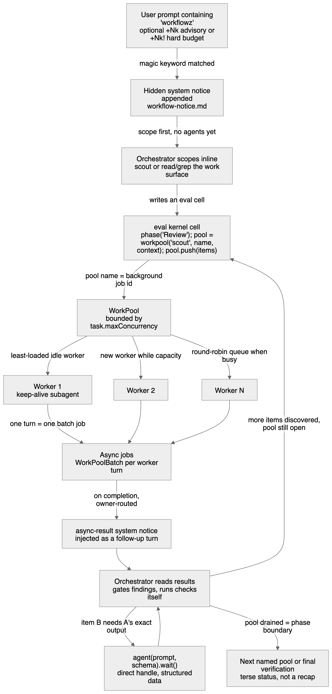
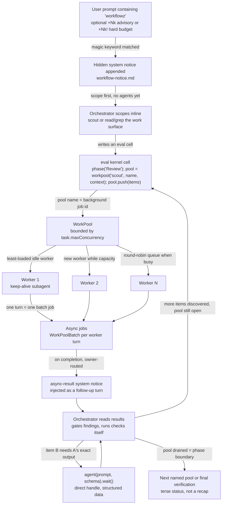

# omp worked examples

Companion to [`research-omp-config-schema.md`](research-omp-config-schema.md),
which holds the key tables. This file holds runnable-shaped examples. Every
field in the examples was read from omp 18.3.1 source unless a line says
"inferred", which means the loader accepts the file but the field's runtime
effect was not traced.

## 1. What `workflowz` produces

`workflowz` is not a config file and produces no artifact of its own. It is a
magic keyword (`src/modes/magic-keywords.ts`) that appends a hidden system
notice (`src/prompts/system/workflow-notice.md`) to the turn. The notice tells
the model to run the work as a deterministic multi-subagent workflow through the
`eval` tool's kernel. What gets produced is a sequence of eval cells written by
the model, background jobs run by the task system, and `async-result` notices
delivered back. The keyword requires the `task` and `eval` tools to be active.

### 1.1 Process diagram



Source: [`diagrams/omp-workflowz-process.mmd`](../diagrams/omp-workflowz-process.mmd).
The `.excalidraw` beside it opens at excalidraw.com for editing; the SVG is
the vector for docs.



### 1.2 Turn by turn

The example task: "review the KXM engine dispatch path for correctness and
security, workflowz +80k". Settings in play: `task.maxConcurrency: 8`,
`eval.py: true`, `eval.tools.enabled: true`, `eval.workpool.freshAgents: false`,
the bundled `scout` agent available.

**Turn 0, user.** The prompt. `+80k` sets an advisory output token ceiling for
the turn; `+80k!` would make it hard, so `agent()` throws once spent passes it
(`src/eval/budget-bridge.ts`, `src/eval/agent-bridge.ts` line 174). Precedence:
a per-turn `+Nk` wins, else an active goal budget, else no ceiling.

**Turn 0, hidden.** The `workflowz` notice is appended. Its rules, verbatim in
spirit: scout inline first; one named pool per phase; push every known item in
one cell; results auto-deliver; never poll; pool output is evidence, not
truth; a drained pool is a phase boundary, not completion.

**Turn 1, orchestrator scopes.** Before any subagent, the orchestrator reads
`engine.ts` and `commands.ts` itself or spawns one scout, and captures phases
in `todo`. Output is a list of disjoint review items.

**Turn 2, orchestrator writes the first eval cell (Python).**

```python
phase("Review")
review = workpool(
    "scout",
    name="review-dispatch",
    context="Read-only. Return evidence with exact path:line. Do not edit. "
            "Skip formatters and tests; the orchestrator verifies.",
)
review.push(
    "Trace prepareDispatch in plugins/kxm/src/engine.ts: which config files gate a step and in what order",
    "Check the implementer->writer alias near engine.ts:1426 for every caller that bypasses it",
    "Audit enforceToolPolicy in plugins/kxm/src/commands.ts for tool names that skip the read-only preset",
    "Find every reader of .kxm/roster.yaml lineup and whether status/permissions are checked on each path",
    "Look for any place a 429 or transport error is caught and retried on another model",
)
log(f"pushed {review.status()['items']['queued']} items; budget {budget.remaining()} left")
print(review.name)   # the background job id; results auto-deliver
```

What the kernel does with it: `workpool()` creates a `WorkPool` named
`review-dispatch` whose name is also its async job id. Each `push` item becomes a
`WorkPoolItem` with status `queued`. The pool assigns items to the least
context-loaded idle worker, spawns a new worker while under
`task.maxConcurrency`, and otherwise round-robins onto a busy worker's queue.
Each worker turn is a `WorkPoolBatch` tracked as an internal job
(`src/task/workpool.ts`). With `freshAgents: false` a worker is a keep-alive
subagent that takes several items in sequence.

**Turn 2, cell output.** The cell returns immediately. The transcript shows the
pool name and the `log()` line; the status tree shows phase "Review" with worker
rows (`state`, `queued`, `turns`, `contextTokens`).

**Turns 3 to 5, deliveries.** As batches settle, each owner session's delivery
sink enqueues an `AsyncResultEntry` and the idle flush injects one follow-up
message of custom type `async-result` (`src/session/async-job-delivery.ts`).
Rendered from `src/prompts/tools/async-result.md`, a multi-job delivery looks
like this:

```text
<system-notice>
3 background jobs have completed. Resume your work using the results below.

── Job review-dispatch/b1 (scout) ──
{summary: "...", files: [{path: "plugins/kxm/src/engine.ts:1420-1445", description: "..."}], architecture: "..."}

Structured output: schema valid; full payload at agent://a7f3c2, fields via agent://a7f3c2/<field>[/<index>/…]
── Job review-dispatch/b2 (scout) ──
...
</system-notice>
```

Results longer than 12,000 characters spill to an artifact with a 4,000
character inline preview. A schema-invalid result adds `Structured output:
schema invalid: <error>` and a JSON preview. The `agent://<id>` URL points at the
subagent's own `<id>.md` and `.json` on disk, and `agent://<id>/files/0/path`
reads one field.

**Turn 6, orchestrator verifies.** The notice forbids trusting pool output. The
orchestrator opens the cited lines, runs `lsp diagnostics` or the project checks
itself, and keeps only findings that survive. Newly discovered items are pushed
to the same pool while it is still open:

```python
review.push("Confirm whether engine.ts:2894 roster check runs before or after admission at 1420")
```

**Turn 7, a dependency-coupled item.** One finding needs an exact artifact
before the next step can be written, so the orchestrator uses a handle instead
of the pool:

```python
SPEC = {"properties": {"gates": {"elements": {"type": "string"}}, "order": {"elements": {"type": "string"}}}}
spec = agent("Extract the exact gate order for a live write step from engine.ts as data",
             agent="scout", schema=SPEC).wait()
patch = agent(f"Draft a test in test/core/engine-dispatch.test.ts asserting this order: {spec}",
              agent="task", isolated=True, apply=False)
result = patch.wait()
```

`isolated=True` runs the task agent in its own worktree copy
(`task.isolation.*`, `isolation.backend`); `apply=False` leaves the change in
that copy for the orchestrator to inspect.

**Turn 8, adversarial pass.** A second named pool, created only after the first
drained:

```python
phase("Verify")
refute = workpool("scout", name="refute-dispatch",
                  context="For the claim given, find evidence that it is WRONG. Return only evidence-backed refutations.")
refute.push(*[f"Refute: {f}" for f in surviving_findings])
```

**Turn 9, judge batch.** Cheap classification over many states without a
subagent per item:

```python
b = judge_batch(surviving_findings,
                [{"id": "sev", "type": "choice", "question": "Severity?", "choices": ["blocker", "major", "minor"]},
                 {"id": "real", "type": "bool", "question": "Is this reproducible from the cited lines alone?"}],
                intent="Scoring dispatch findings")
async for key, item in b.drain_iter(60):
    if item.error is None and item.result["real"]:
        keep.append((key, item.result["sev"]))
b.close()
```

**Turn 10, close.** Every pool drained, todos closed, final gates rerun by the
orchestrator, a terse status. Nothing was written to disk by the workflow
itself except the subagent artifacts under `~/.omp/agent/sessions/`, and the
isolated patch copy from turn 7.

### 1.3 What this is not

- Not a file. There is no `.omp/workflows/`. Re-running the same workflow means
  re-issuing the prompt; the phases live in the transcript and `todo`.
- Not deterministic in structure. The notice constrains behavior; the model
  chooses items, pools, and phases each run.
- Not gated. Verification is an instruction to the orchestrator, not a
  `kxm.workflow.v1` gate step with `maxAttempts` and `on.failed` transitions.

KXM's equivalent is the workflow file plus the coordinator agent. The one omp
mechanism with no KXM counterpart worth noting is the per-turn token budget with
advisory and hard modes, which belongs with `plan-usage-cost-quota-tracking.md`.

## 2. The role and agent split

Both systems benefit from separating "which model, in what order, with what
fallback" (role) from "what work, which tools, what it returns" (agent). omp
does it by construction. The alignment plan proposes it for KXM. Here is the
same setup on both sides.

### 2.1 omp: role side, `.omp/config.yml` (project scope)

```yaml
# Project layer. Merges over ~/.omp/agent/config.yml; a key here wins.
# Credentials never come from this layer.
modelRoles:
  default: xai-oauth/grok-4.7:medium          # writer
  plan: anthropic/claude-fable-5-1:medium     # planner
  slow: anthropic/claude-fable-5-1:high       # reviewer-arch
  smol: alibaba-coding-plan/qwen3.8-flash:low # cheap worker
  tiny: "@smol"
  task: "@default"
  reviewer-cli: openai-codex/gpt-5.6-sol:low  # custom role, unverified provider id
modelRoleStorage: project
modelTags:
  reviewer-cli: { name: "CLI reviewer", color: muted }
cycleOrder: [smol, default, slow, plan, reviewer-cli]
retry:
  maxRetries: 6
  modelFallback: true
  fallbackRevertPolicy: cooldown-expiry
  fallbackChains:
    default:
      - openrouter/qwen/qwen3-coder-plus
      - alibaba-coding-plan/qwen3.8-flash
    plan:
      - alibaba-coding-plan/qwen3.8-max
    slow:
      - alibaba-coding-plan/qwen3.8-max:high
    reviewer-cli:
      - alibaba-coding-plan/qwen3.8-flash:low
```

### 2.2 omp: agent side, `.omp/agents/kxm-reviewer-arch.md`

```markdown
---
name: kxm-reviewer-arch
description: "Read-only architecture critic for a KXM implementation diff. Use after implement, before verify."
tools: read, find, grep, glob, lsp, ast_grep
spawns: scout
model: "@slow"
thinking-level: high
readSummarize: true
autoloadSkills: kxm, kxm-protocol
output:
  properties:
    verdict: { enum: [passed, failed] }
    findings:
      elements:
        properties:
          path: { type: string }
          summary: { type: string }
          severity: { enum: [blocker, major, minor] }
  optionalProperties:
    notes: { type: string }
---
Review the diff for architectural integrity against AGENTS.md and the plan it
cites. Cite `path:line` for every finding. Never edit files. Return the schema
above and nothing else.
```

The agent names a role, not a model. Swapping the reviewer's model, effort, or
fallback chain is a `config.yml` edit; the agent file never changes.

### 2.3 KXM: role side, `.kxm/roles/reviewer-arch.yaml` (proposed `kxm.role.v2`)

```yaml
schema: kxm.role.v2
id: reviewer-arch
description: Independent architecture critic. Read-only. Vendor must differ from the writer's.
skills: [kxm, kxm-protocol]
tools:
  preset: read-only
roster:
  - model: anthropic/fable
    harness: claude
    effort: high
    enabled: true
  - model: qwen-token-plan/qwen3.8-max
    harness: pi
    effort: high
    enabled: true
policy:
  vendorIndependenceRequired: true
  requiresGateVerification: true
  fallback:
    onError: [rate_limit, transport]
    maxSwitches: 1
    revert: next_run
```

### 2.4 KXM: agent side, `.kxm/agents/critic-arch.yaml` (`kxm.agent.v1` plus proposed `role:`)

```yaml
schema: kxm.agent.v1
purpose: Architecture critic for the approved workflow change.
role: reviewer-arch                 # model, effort, fallback come from the role
tools:
  preset: read-only                 # may only narrow the role preset
defaultRepositoryAccess: read
repositories:
  control: read
network: provider-only
resultSchema: kxm.assignment-result.v1
```

Today's file pins `harness: claude` and `model: {provider: anthropic, model:
fable}` here. Under the split those lines go, and the workflow step
`review-arch` still references `agent: critic-arch` unchanged.

## 3. One example per remaining omp surface

### 3.1 `~/.omp/agent/config.yml` (global) versus `.omp/config.yml` (project)

Global holds machine and account preferences; project holds what a checkout
needs. Everything in section 2.1 is valid in either. A global file on this
machine today:

```yaml
modelRoles:
  default: xai-oauth/grok-4.7:high
  plan: anthropic/claude-opus-5-5
symbolPreset: nerd
composer: { shape: box }
theme: { dark: titanium, light: light }
setupVersion: 2
```

A fuller global example of the operational groups, all keys verified in the
evidence table:

```yaml
defaultThinkingLevel: medium
providers:
  anthropic: { serverSideFallback: true, slowMode: "off" }
  cacheRetention: long
  maxInFlightRequests: { alibaba-coding-plan: 2, xai-oauth: 4 }
  streamIdleTimeoutSeconds: 120
task:
  maxConcurrency: 8
  maxRecursionDepth: 2
  maxRuntimeMs: 1800000
  enableEffort: true
  maxEffort: high
  isolation: { enabled: true, apply: true, merge: patch, commits: generic }
compaction:
  enabled: true
  asyncEnabled: true
  keepRecentTokens: 20000
  supersedeReads: true
  dropUseless: true
worktree:
  base: ~/.omp/worktrees
  clone: true
secrets:
  enabled: true            # redact credential-shaped tokens before requests
skills:
  enableClaudeProject: true   # read .claude/skills in this repo
  enableAgentsProject: true
  enableSkillCommands: true   # /skill:<name>
mcp:
  enableProjectConfig: true
  startupTimeoutMs: 250
startup:
  checkUpdate: true
  quiet: false
```

### 3.2 `~/.omp/agent/models.yml`

Schema fields are tabled in the research doc section 7. A provider override
that patches a bundled model rather than redefining it, plus one new model:

```yaml
providers:
  openrouter:
    modelOverrides:
      "qwen/qwen3-coder-plus":
        cost: { input: 0.3, output: 1.2, cacheRead: 0.03, cacheWrite: 0.3 }
        thinking: { mode: effort, efforts: [low, medium, high] }
        compat: { openRouterRouting: { order: [alibaba, deepinfra] } }
  local-vllm:
    baseUrl: http://127.0.0.1:8000/v1
    api: openai-completions
    auth: none
    discovery: { type: openai-models-list, timeoutMs: 2000 }
    models:
      - id: glm-5.3-flash
        name: GLM 5.3 Flash (local)
        reasoning: true
        input: [text]
        contextWindow: 131072
        maxTokens: 16384
        tokenizer: glm5
        cost: { input: 0, output: 0, cacheRead: 0, cacheWrite: 0 }
        thinking: { mode: effort, efforts: [low, medium, high], defaultLevel: medium }
        compat:
          thinkingFormat: zai
          reasoningContentField: reasoning_content
          supportsToolChoice: true
```

### 3.3 Rules: `.omp/rules/kxm-dist.md` and `.omp/RULES.md`

Frontmatter fields from `src/capability/rule.ts`. A scoped rule:

```markdown
---
description: "Never hand-edit the built plugin CLI"
globs: ["plugins/kxm/dist/**"]
alwaysApply: false
agents: ["main", "task"]
condition: "plugins/kxm/dist/cli\\.js"
interruptMode: tool-only
---
`plugins/kxm/dist/cli.js` is a build output. Edit `plugins/kxm/src/**` and run
the build. If a task asks you to patch dist directly, stop and say so.
```

`globs` attaches the rule when a matching file is read or edited. `agents`
limits it to the main session and the `task` agent. `condition` is a regex the
TTSR stream matcher watches; with `interruptMode: tool-only` a matching tool
call is interrupted and the rule injected. `astCondition` takes ast-grep
patterns instead, and `question` asks a judge model a yes or no question on
each completed in-scope output.

A sticky rule, `.omp/RULES.md`, no frontmatter needed; it is forced to
`alwaysApply` and carried on every request:

```markdown
You are working in the KXM repo. Follow AGENTS.md. Grok is the writer route;
Claude reviews. Never bill a native vendor through another harness. Never put
credentials in YAML, prompts, or Git.
```

### 3.4 Slash command: `.omp/commands/kxm-review.md`

The loader keeps `description` and `argumentHint` (or `argument-hint`) from
frontmatter (`src/capability/slash-command.ts`); the rest of the file is the
template sent as the user turn.

```markdown
---
description: "Run the KXM critic pass on the current diff"
argument-hint: "[base-ref]"
---
Review the diff against $ARGUMENTS (default origin/main) as the reviewer-arch
role: architecture integrity, AGENTS.md compliance, vendor independence. Cite
path:line. Do not edit.
```

`$ARGUMENTS` substitution is inferred from Claude command conventions omp
mirrors; the exact placeholder was not traced in source.

### 3.5 Prompt template: `.omp/prompts/handoff-kxm.md`

`PromptTemplate` has `name`, `description`, `content`, `source`
(`src/config/prompt-templates.ts`). Templates render through the shared
`prompt` helper with Handlebars-style blocks.

```markdown
---
description: "Handoff packet for the next KXM session"
---
Write a handoff for the next session. Include: branch and dirty files, the plan
file being executed, the last passed gate, open questions. Keep it under 40
lines. Save it under plans/handoff/ with today's date.
```

### 3.6 Hooks and extensions: `.omp/hooks/*.ts`, `.omp/hooks/pre/<tool>`, `.omp/extensions/*.ts`

Two forms are discovered. A module in `hooks/` or `extensions/` exports a
function that receives the `HookAPI` and subscribes to events
(`examples/hooks/README.md`, `src/extensibility/hooks/loader.ts`):

```typescript
// .omp/hooks/kxm-guard.ts
import type { HookAPI } from "@oh-my-pi/pi-coding-agent/hooks";

export default function (pi: HookAPI) {
  pi.on("tool_call", async (event, ctx) => {
    if (event.toolName === "bash" && /kxm\s+(hub|run)\b/.test(String(event.input.command ?? ""))) {
      const ok = await ctx.ui.confirm("KXM", "This starts KXM runtime state. Continue?");
      if (!ok) return { block: true, reason: "Blocked: KXM state must be isolated in this session" };
    }
    if (event.toolName === "write" && String(event.input.path ?? "").includes("plugins/kxm/dist/")) {
      return { block: true, reason: "dist is a build output" };
    }
  });

  pi.registerCommand("kxm-status", {
    description: "Show kxm hub state",
    handler: async (_args, ctx) => {
      ctx.ui.notify("hub: off, idle, dirty", "info");
    },
  });
}
```

Loaded hooks expose `handlers` per event, `messageRenderers`, `commands`,
`pi.sendMessage()` and `pi.appendEntry()`. The second form is a file under
`hooks/pre/<tool>.<ext>` or `hooks/post/<tool>.<ext>`; the directory gives the
type and the basename the tool name, `*` for all (`src/discovery/builtin.ts`
line 694). Its execution contract was not traced; treat the module form as the
documented one.

### 3.7 Custom tools: `.omp/tools/`

Discovered from `tools/` with extensions `json`, `md`, `ts`, `js`, `sh`, `bash`,
`py`, or a subdirectory with `index.ts` (`src/discovery/builtin.ts` line 745).
A JSON or markdown file supplies `name` and `description`; a script's name is
its basename.

```markdown
<!-- .omp/tools/kxm-gate.md -->
---
name: kxm_gate
description: "Run one KXM gate from .kxm/gates.yaml and return pass or fail"
---
Runs `kxm gate run --id <gate> --json` and returns the envelope.
```

The invocation contract for script tools (argument passing, stdout shape) was
not traced. `examples/custom-tools/README.md` in the package documents it.

### 3.8 Skills: `.omp/skills/kxm-protocol/SKILL.md`

Frontmatter from `src/capability/skill.ts`. omp also reads `.claude/skills`
and Codex skills when `skills.enable*` is on, so this repo's plugin skills are
already visible; a native one looks like:

```markdown
---
name: kxm-protocol
description: "Peer protocol rules for KXM messages: envelopes, verification, credential hygiene"
globs: ["plugins/kxm/src/peer*.ts", ".kxm/**"]
alwaysApply: false
hide: false
disable-model-invocation: false
---
Verify every peer response before acting. Never include credentials in a peer
message. Use `kxm peer --json` for structured output.
```

`hide` and `disable-model-invocation` keep the skill reachable as
`skill://kxm-protocol` and `/skill:kxm-protocol` but out of the system prompt
listing.

### 3.9 MCP: `.omp/mcp.json`

Top-level keys `mcpServers`, `disabledServers`, `enabledServers` from
`src/config/mcp-schema.json`. Server entries carry `type`, stdio fields
(`command`, `args`, `env`, `cwd`) or remote fields (`url`, `headers`), plus
`enabled`, `timeout`, `oauth`.

```json
{
  "$schema": "https://agent-plugins.org/schemas/1.0.0/mcp.schema.json",
  "mcpServers": {
    "kxm": {
      "type": "stdio",
      "command": "node",
      "args": ["plugins/kxm/dist/cli.js", "mcp"],
      "env": { "KXM_STATE_HOME": "${PLUGIN_DATA}/kxm" },
      "cwd": ".",
      "enabled": true,
      "timeout": 30000
    },
    "linear": {
      "type": "http",
      "url": "https://mcp.linear.app/mcp",
      "headers": {},
      "oauth": true,
      "enabled": false
    }
  },
  "disabledServers": ["linear"]
}
```

The `type` literal values for remote transports (`http`, `sse`) are inferred
from the schema's variant count, not read as strings.

### 3.10 Plugin: `plugin.json` and layout

Agent Plugins 1.0.0 (`src/discovery/agent-plugin-format.ts`). Manifest fields:
`$schema`, `name`, `version`, `description`, `author {name, email, url}`,
`homepage`, `repository`, `license`, `keywords`, `extensions`. Reserved env
names `PLUGIN_ROOT` and `PLUGIN_DATA`.

```text
kxm-omp-plugin/
  plugin.json
  mcp.json
  agents/kxm-reviewer-arch.md
  skills/kxm-protocol/SKILL.md
  commands/kxm-review.md
  rules/kxm-dist.md
  prompts/handoff-kxm.md
  hooks/kxm-guard.ts
```

```json
{
  "$schema": "https://agent-plugins.org/schemas/1.0.0/plugin.schema.json",
  "name": "kxm",
  "version": "0.7.118",
  "description": "KXM peer, workflow, and context tools for omp",
  "author": { "name": "KontextMind", "url": "https://github.com/kontextmind" },
  "repository": "https://github.com/kontextmind/kxm",
  "license": "MIT",
  "keywords": ["kxm", "agents", "workflow"],
  "extensions": {}
}
```

This is the shape `kxm plugin install --omp` targets. The current installer
output was not diffed against it here.

### 3.11 Context file: `AGENTS.md`

Read from `~/.omp/agent/AGENTS.md` and the nearest project `AGENTS.md` walking
up from cwd (`src/discovery/agents-md.ts`, `builtin.ts` line 917). No
frontmatter. This repo's `AGENTS.md` is already picked up; nothing to add.

## 4. Verification status

| Surface | Fields verified in source | Inferred |
|---|---|---|
| `config.yml` keys | all keys used, via the extracted table | none |
| `modelRoles`, `retry.fallbackChains` | grammar and semantics from the setting description and resolver | provider ids other than `xai-oauth`, `anthropic`, `alibaba-coding-plan` |
| agents frontmatter | every key in `ParsedAgentFields` | none |
| `models.yml` | every field in the schema bundle | none |
| rules | every key in `RuleFrontmatter` | none |
| commands | `description`, `argument-hint` | `$ARGUMENTS` placeholder |
| prompts | type fields | template variables |
| hooks, extensions | module API from README and loader types | `hooks/pre/<tool>` execution contract |
| custom tools | discovery and naming | script invocation contract |
| skills | every key in `SkillFrontmatter` | none |
| `mcp.json` | top-level and entry property names | remote `type` literals |
| `plugin.json` | manifest fields and reserved env | none |
| workflowz | notice text, kernel helpers, pool and delivery types, budget precedence | exact delivery job id format in the example |
